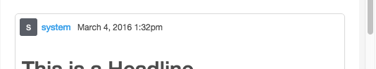
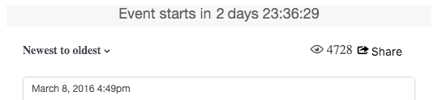
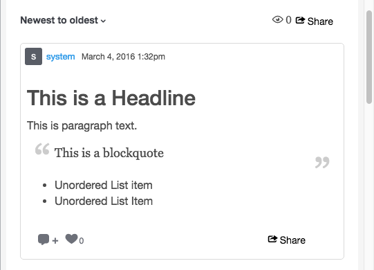
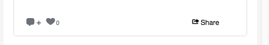

# CSS-klassen stabiliseren{#storify-css-classes}

CSS-klassen beschikbaar voor uw Storify-apps.

Gebruik CSS om uw Storify Apps voor een volledigere integratie met uw pagina aan te passen, door eenvoudig het gebrek CSS met uw eigen stijlblad met voeten te treden. In deze sectie worden de beschikbare CSS-aanpassingen beschreven.

## Auteurselementen {#section_tdy_hsh_xz}

Hiermee kunt u de opmaak aanpassen voor de auteur van het bericht, de auteur en de tijdstempel.

| Klasse | Beschrijving |
|---|---|
| .s-signer-name | Auteur |
| .s-auteur-avatar | De avatar van de auteur. |
| .s-img | De avatarafbeelding van de auteur. |
| .s-timestamp | De tijdstempel voor de datuminhoud is gepost. |

## Koptekstelementen {#section_nbv_gsh_xz}

Hiermee kunt u de koptekstsectie voor de artikelpagina aanpassen.

| **Klasse** | **Beschrijving** |
|---|---|
| .super-header | Hoofdkoptekst |
| .outer-header | Hoofdkoptekstrij 1 |
| .s-countdown | Afteltimer voor hoofdkoptekstrij 1 |
| .s-liviteit | Hoofdkoptekstrij 1 &quot;Live&quot;-status |
| .base-header | Hoofdkoptekstrij 2 |
| .s-dropdown | Hoofd koptekstrij 2 de dropdown trekker van de Sortering. |
| .s-dropdown-menu | Hoofdkoptekstrij 2 Het vervolgkeuzemenu Sorteren. |
| .s-dropdown-driehoek | Hoofd koptekstrij 2 de dropdown menuinlasteken van de Soort. |
| .s-dropdown-optie | Hoofdkoptekstrij 2 Vervolgkeuzemenu-item sorteren. |
| .s-views | Hoofdkoptekstrij 2 aantal weergaven. |
| .s-share-button | Hoofdkoptekstrij 2, knop Delen. |
| .s-share-menu | Hoofdkoptekstrij 2 Delen, menu. |

## Elementen {#section_lrs_fsh_xz} plaatsen

Hiermee kunt u de opmaak aanpassen voor de artikelelementen van het bericht.

| **Klasse** | **Beschrijving** |
|---|---|
| .s-liveblog | Container voor het gehele element Artikel |
| .s-post | De postcontainer |
| .s-modal-content | Post-modale container |
| .s-element-content | Alle inhoudselementen in een bericht |
| .s-element-text ul | Tekstelement |
| .s-element-tekst h2 | Titel tekstelement |
| .s-element-text p | Alinea van tekstelement |
| .s-element-text ul | Niet-geordende lijst met tekstelementen |
| .s-element-text ol | Geordende lijst met tekstelementen |
| .s-element-text li | Lijstitems voor tekstelementen |
| .s-element-text blockquote | Blockquote |
| .s-element-text blockquote:before | Het pictogram voor het begin van een blockquote |
| .s-element-text blockquote:after | Het pictogram voor het einde van een blockquote |
| .s-element-image | Inline-afbeeldingselementcontainer |
| .s-img | `` element |
| .s-image-caption | Bijschrift voor afbeeldingen en video&#39;s op sociale media (bijv.: Installagramafbeelding) |
| .s-upload-image-caption | Bijschrift voor afbeeldingen en video&#39;s die zijn geüpload via de artikeleditor |
| .s-element-video | Video-element |
| .s-element-quote | Offerteelement (bijv. Tweet met alleen tekst) |
| .s-element-quote-image | Citaat met afbeeldingselement (bijv. Tweet met afbeelding) |
| .s-element-quote-video | Citaat met video-element (bijv. Tweet met video) |
| .s-link-body | Voorvertoning van koppeling in een aanhalingsteken (bijvoorbeeld: Tweet met/koppelingsvoorvertoning) |

## Voettekstelementen {#section_ozc_zrh_xz}

Hiermee kunt u de voettekstsectie voor elke afzonderlijke advertentie aanpassen.

| **Klasse** | **Beschrijving** |
|---|---|
| .s-post-footer | De voettekst van het bericht. |
| S-sidenotes a | De knop Sidenotes in de voettekst van het bericht. |
| .s-achtig | De knop ‘Gelijkaardig’ in de voettekst van het bericht. |
