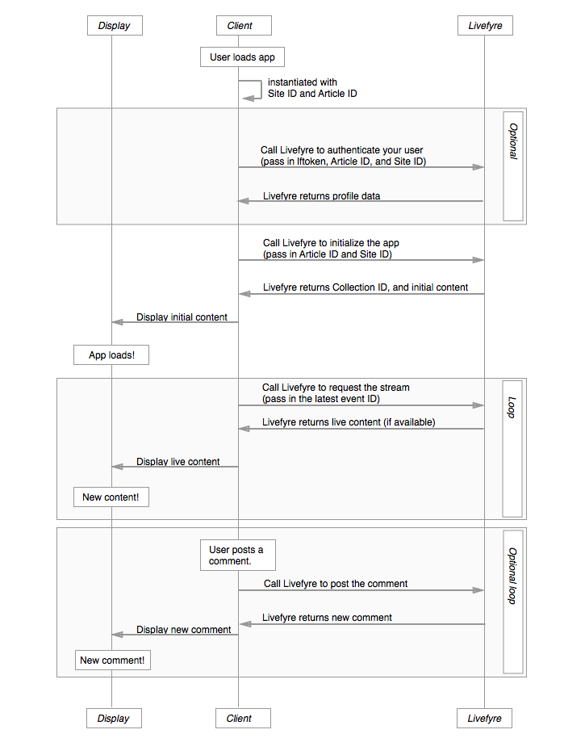

# Architectuur{#architecture}

Leer de Livefyre-conventies en de manier waarop LiveCyre inhoud indeelt.

Deze sectie biedt een overzicht van de Livefyre Network Architecture.

## Overzicht van netwerken en sites

LiveCycle organiseert gebruikers en inhoud per netwerk en site. Elk netwerk kan één of meerdere gebruikersrekeningen verbonden aan het hebben, en elk netwerk kan één of meerdere plaatsen van de Levensstijl omvatten. Een LiveCycle-site is een willekeurige groep verzamelingen. Eén verzameling is toegewezen aan één artikel-id in uw CMS.

## Werken met netwerken {#section_hqt_4m4_xz}

De klanten met veelvoudige domeinen kunnen gebruikersrekeningen over alle domeinen delen, gebruikend één enkel netwerk van de Levensstijl. De klanten die afzonderlijke gebruikersrekeningen voor verschillende domeinen willen houden zullen afzonderlijke netwerken van de Levensstijl vereisen.

De montages van de configuratie kunnen op plaatsen, netwerken en Inzamelingen van toepassing zijn (die als gesprek in de illustratie hierboven worden bedoeld).

>[!NOTE]
>
>Sommige instellingen zijn alleen beschikbaar op netwerkniveau (zoals voorkeuren voor e-mailmeldingen, e-mailadressen en aangepaste e-maillogo&#39;s). Als u wilt dat deze instellingen voor elk domein anders zijn, moet u meerdere netwerken gebruiken.

## Sites {#section_vjw_nm4_xz}

Een site is een willekeurige groep artikelen. De groepering is nuttig aangezien het u toestaat om verschillende moderators aan verschillende groepen inhoud toe te wijzen. De moderatoren en de eigenaars kunnen opstelling zijn aan gematigde inhoud en vormen adminmontages op of het netwerk of plaatsniveau. Als u sommige moderatoren slechts bepaalde Inzamelingen wilt zien, kunnen deze Inzamelingen opstelling als afzonderlijke plaats van de Levensstijl zijn.

>[!NOTE]
>
>Er is geen limiet aan het aantal sites dat u onder uw aangepaste netwerk hebt.

## Diagram toepassingsreeks {#section_mw2_lm4_xz}

Of u nu een aangepaste functie wilt implementeren met de door Livefyre verschafte eindpunten of alleen maar een probleem wilt opsporen, het helpt u te begrijpen hoe de aanvraag-/responsstroom voor de Livefyre-app werkt.

1. Wanneer uw klant uw site raakt, instantieert u de LiveCycle-app met de site-id en artikel-id.
1. Als u de gebruiker wilt verifiëren (waardevol voor verkeersevaluatie, evenals plaats-bescherming), verzend Livefy de plaatsinfo, en het teken van het Profiel van de Gebruiker.
1. Stuur LiveCycle de site-id en artikel-id om de app te initialiseren.

   Livefyre retourneert de oorspronkelijke inhoud.

   Verzend deze inhoud naar de pagina en geef de app weer.

1. Als u de inhoud wilt bijwerken die op de pagina wordt weergegeven, verzendt u LiveCyre de meest recente gebeurtenis-id van de pagina. Als er nieuwe inhoud beschikbaar is, wordt deze geretourneerd.

   Laad de pagina opnieuw met nieuwe inhoud en herhaal het proces voor onbepaalde tijd.

1. Als u gebruikers toestaat nieuwe inhoud te posten, activeert u een gebeurtenis wanneer nieuwe inhoud op uw site wordt gepost om de inhoud naar LiveCycle te posten. Livefyre retourneert een bijgewerkte stream die u kunt gebruiken om uw site bij te werken.
