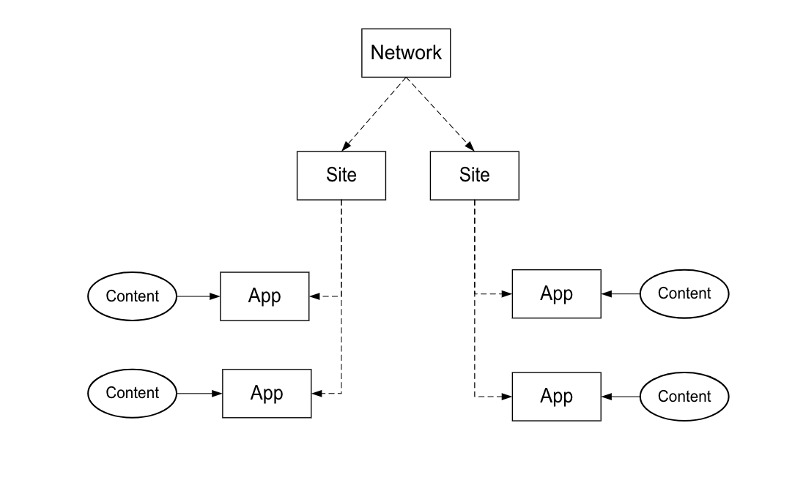

# Implementatieproces{#implementation-process}

De duur van de implementatie van Livefyre is afhankelijk van uw implementatie en werkterrein.

## Overzicht van de Livefyre Netwerkarchitectuur {#section_dgj_l32_rbb}

Het leven gebruikt de volgende termijnen in het bespreken van netwerkarchitectuur:

* Netwerk. Het domein op het hoogste niveau waarop u Livefyre wilt gebruiken.
* Sites. Een subdomein of sitesectie die deel uitmaakt van het netwerk.
* Apps. Een weergave van inhoud op uw site. Inhoud wordt visueel weergegeven in Apps met behulp van visualisatie-apps (mozaïek, carrousel, functiekaart, enz.) of in tekstformaat, gebruikend de Apps van de Gesprek (Commentaren, Revisies, Chat, enz.). U kunt een of meer apps op uw sites plaatsen.
* Streams. Streams zijn filters waarmee sociale media en andere sites worden gezocht om inhoud automatisch te verzamelen voor moderatie of directe publicatie in een app.
* Inhoud (bijvoorbeeld UGC, opmerkingen). Wat wordt weergegeven in de toepassingen. Inhoud kan visueel zijn (bijvoorbeeld een foto of video), alleen-audio of tekst.

Het volgende diagram toont het verband tussen Netwerk, Plaatsen, Apps, en Inhoud.

U hebt uw eigen instantie Livefyre die uw centraal dashboard voor het modereren van inhoud, het leiden van gebruikers, en meer is. Neem contact op met uw CSM voor toegang tot uw LiveCycle-instantie.

## Integratiestappen {#section_s2j_d2x_tz}

Er zijn drie belangrijke stappen om Livefyre te integreren:

* Toepassingsintegratie

   Wanneer u Livefyre implementeert, hangt de implementatiestijl af van uw gebruiksscenario. Voor [meer op elk implementatietype](/help/implementation/c-getting-started/c-implementation-process/c-app-integration-types.md#c_app_integration_types).

* Verificatieintegratie

   U moet uw bestaande systeem van het gebruikersbeheer met Livefyre voor gesprekstoepassingen en om het even welke andere Toepassingen integreren die eindgebruikersauthentificatie op uw plaats vereisen. Als u momenteel geen hulpmiddel voor gebruikersbeheer gebruikt, kunt u de Identiteit van de Levensstijl gebruiken. Voor [meer informatie over Livefyre Identiteit, wat het is, en hoe te opstelling](/help/implementation/c-livefyre-identity-comp/c-livefyre-identity-comp.md#c_livefyre_identity).

* Aanpassing

   Aanpassing is optioneel, maar de meeste klanten passen Apps aan hun merk aan.

