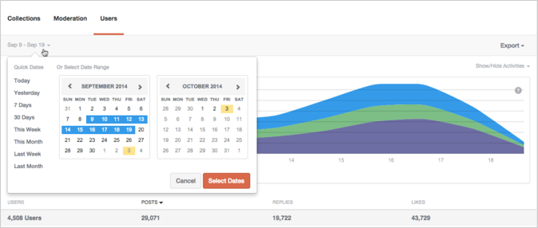
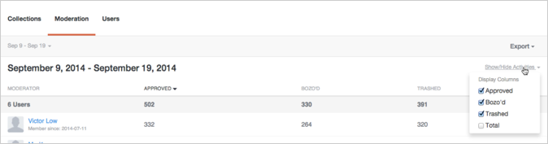
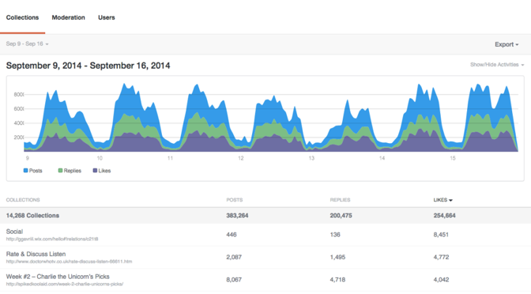
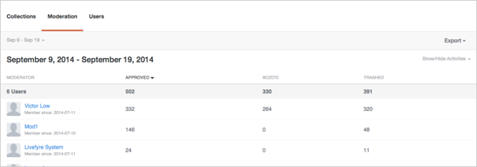
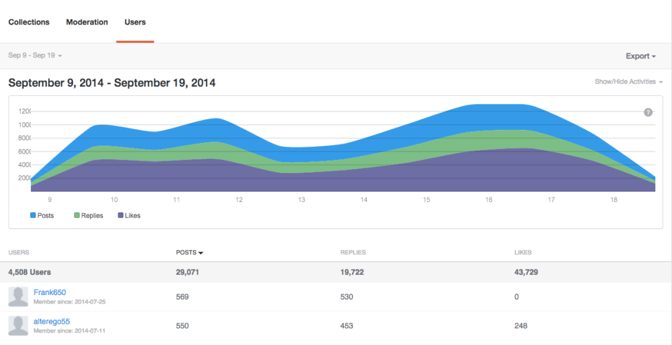

# Analyse{#analytics}

Analyseer de gebruikers-, inhoud- en moderatoractiviteiten voor uw site.

## Analyse {#topic_22D8FAE581CD440EA02B1595520F60C2}

Analyseer de gebruikers-, inhoud- en moderatoractiviteiten voor uw site.

De Analytics van de levensparantie verleent toegang tot uw netwerkgegevens in gemakkelijk te lezen dashboards voor Conversations, Moderation en gegevens van de Gebruiker. Gebruik deze dashboards om de activiteit te controleren en snelle analyses op uw plaats(en) uit te voeren.

De dashboards kunnen door plaats, datum, en activiteit worden gefiltreerd. Gebruik de keuzelijst Netwerk linksboven in het venster om de site te selecteren die u wilt weergeven. Klik op een kolomkop om de grafiek te sorteren, of klik met de muis boven de grafiek voor meer specifieke informatie over een willekeurig gegevenspunt.

Deze pagina beschrijft:

* Een [Datumbereik](https://answers.livefyre.com/livefyre-studio-version-1/studio/analytics/#DateRange) voor het dashboard selecteren
* [Beschikbare activiteiten weergeven/verbergen](https://answers.livefyre.com/livefyre-studio-version-1/studio/analytics/#ShowHideActivities)
* [Dashboardgegevens exporteren](https://answers.livefyre.com/livefyre-studio-version-1/studio/analytics/#ExportDashboardData)
* [Het dashboard Verzamelingen](https://answers.livefyre.com/livefyre-studio-version-1/studio/analytics/#CollectionsDashboard)
* [Het dashboard voor modernisering](https://answers.livefyre.com/livefyre-studio-version-1/studio/analytics/#ModerationDashboard)
* [Het gebruikersdashboard](https://answers.livefyre.com/livefyre-studio-version-1/studio/analytics/#UsersDashboard)

>[!NOTE]
>
>Analyses ondersteunen momenteel activiteiten die afkomstig zijn van Livefyre Core Apps en Moderation. De meeste activiteiten in deze dashboards zijn ook beschikbaar via [Live JavaScript Events](https://answers.livefyre.com/developers/reference/app-customizations/javascript-events/), die kunnen worden gebruikt om uw eigen aangepaste of externe analyseprogramma aan te sturen.

## Datumbereik {#concept_798C438120E643B6BE262C9997DC87C4}

Klik op de datumkeuzelijst om een bereik te selecteren dat u wilt weergeven. Gebruik de snelle datums of selecteer een begin- en einddatum in de opgegeven kalenders.

Snelle datums:

* **Vandaag:** Toont gegevens van middernacht de ochtend van de huidige dag, tot het laatste volledige uur vóór dit moment.
* **Gisteren:** geeft de gegevens van de vorige 24 uur weer.
* **7 dagen:** Geeft de gegevens van de vorige 7 dagen weer, exclusief vandaag.
* **30 dagen:** Geeft de gegevens van de voorgaande 30 dagen weer, exclusief vandaag.
* **Deze week:** Hier worden gegevens weergegeven van middernacht op de ochtend van afgelopen zondag tot het laatste volledige uur voor dit moment.
* **Deze maand:** Toont gegevens van middernacht de ochtend van de eerste dag van de huidige maand, tot het laatste volledige uur vóór dit moment.
* **Vorige week:** geeft de gegevens van vorige week weer.
* **Vorige maand:gegevens van vorige maand** weergeven.

## Activiteiten {#concept_022D9851CBCE4A2FB80D0AE52A23744D} tonen/verbergen

Activiteiten zijn acties die gebruikers op uw site uitvoeren, zoals opmerkingen plaatsen, markeren, delen en modereren. Gebruik **Activiteiten tonen/verbergen** keuzelijst om activiteiten te selecteren die u in het dashboard wilt opnemen.

>[!NOTE]
>
>Als u nieuwe gebeurtenissen voor het filter selecteert, wordt de pagina opnieuw weergegeven zonder de URL te wijzigen.

De beschikbare activiteiten variëren per dashboardtype en export en kunnen het volgende omvatten:

* **Post:** Toont gegevens van middernacht de ochtend van de huidige dag, tot het laatste volledige uur vóór dit moment.
* **Reacties:** geeft de gegevens van de vorige 24 uur weer.
* **Likes:** toont de gegevens van vorige 7 dagen, niet met inbegrip van vandaag.
* **Niet leuk:** geeft de gegevens van de vorige 30 dagen weer, niet inclusief vandaag.
* **Bevat media:** Toont gegevens van middernacht de ochtend van vorige Zondag, tot het laatste volledige uur vóór dit moment.
* **Post heeft foto&#39;s geüpload:** geeft gegevens weer vanaf middernacht op de ochtend van de eerste dag van de huidige maand, tot het laatste volledige uur voor dit moment.
* **Post heeft koppeling:** geeft de gegevens van vorige week weer.
* **Post heeft @mnotices:Gegevens van vorige maand** worden weergegeven.
* **Goedgekeurd:Gegevens van vorige maand** worden weergegeven.
* **Bozo&#39;d:Gegevens van vorige maand** weergeven.
* **Verlopen:Gegevens van vorige maand** worden weergegeven.
* **Totaal van de modernisering:** Toont de gegevens van vorige maand.

## Dashboardgegevens exporteren {#concept_730DB61A9F894BE6BFB34E0E2A421ED3}

Met het keuzemenu **Exporteren** kunt u uw dashboardgegevens exporteren als een CSV-bestand.

* Dagelijkse samenvatting (alleen verzamelingen): exporteert de dagelijkse tabellen van de laatste volledige week voor elke verzameling.
* Tabelgegevens: Hiermee exporteert u alle opgeschoven verzamelingsgegevens (alle kolommen en alle rijen in het huidige rapport).
* Onbewerkte gegevens: Hiermee exporteert u alle afzonderlijke gebeurtenissen die zijn gebruikt om het huidige oprolrapport te maken.

>[!NOTE]
>
>Deze rapporten kunnen een paar minuten duren om te worden geëxporteerd. Alle tijdstempels zijn Unix-tijd.

## Verzamelingen {#concept_228D8E5553784DB8BABF3819A5FF0345}

Het dashboard van Inzamelingen maakt een lijst van gebruikersactiviteit door Inzameling, die u toestaat om uw het meest (en minst) het in dienst nemen inhoud te bepalen. Elke vermelde verzameling bevat een koppeling naar de pagina waarop deze kan worden gevonden.

## Moderatie {#concept_98689B1E804B43CEA21E3F456107CCD9}

Het dashboard van de Moderatie maakt een lijst van gebeurtenissen door moderator, die u toestaat om hun activiteit te evalueren. Gebruik dit rapport om uw actiefste Moderatoren, en hun gemeenschappelijkste matigingsacties te vinden.

>[!NOTE]
>
>De geautomatiseerde Livefyre moderatie activiteiten zullen voor de moderatornaam Livefyre Systeem worden vermeld.

## Gebruikers {#concept_D1A83E31C7B5467F9C844CBF9A740E12}

Het dashboard Gebruikers geeft de siteactiviteit per gebruiker weer, zodat u kunt analyseren hoe individuele gebruikers met uw site werken. Gebruik dit dashboard om uw meest actieve gebruikers over uw plaats te vinden, en de populairste plaatsactiviteiten te evalueren.

