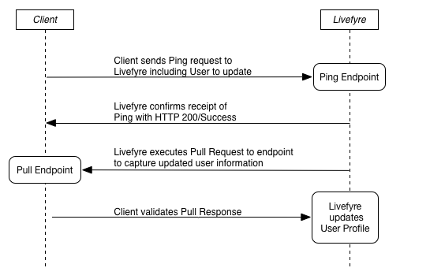

# Synchroniseren met Livefyre Ping for Pull{#sync-with-livefyre-using-ping-for-pull}

Gebruik Ping for Pull om Livefyre synchroon te houden met uw gebruikersbeheersysteem.

In het algemeen ***Ping*** Leven wanneer een gebruiker van uw website/app zijn profiel (vertoningsnaam, avatar, enz.) bijwerkt, en Livefyre ***Pulls*** het bijgewerkte profiel van die gebruiker.

Pingel voor volgreeks:

1. De klant stuurt een Ping-aanvraag naar Livefyre (inclusief de gebruiker die moet worden bijgewerkt).
1. Livefyre bevestigt ontvangstbewijs van Ping met HTTP 200/Succes.
1. Livefyre verwerkt het volledige verzoek.
1. Livefyre wachtt de vraag van de Trek.
1. Livefyre voert het Volledige verzoek aan eindpunt uit om bijgewerkte gebruikersinfo te vangen.
1. De klant ontvangt de volledige reactie en valideert deze.
1. Livefyre werkt Externe Profielen met externe profielinfo bij inbegrepen in het Pull eindpunt.

Pingel Livefyre wanneer een gebruiker hun profielinformatie bijwerkt. Terwijl Pingel voor de voltooiing van de Trek afhankelijk van netwerklading kan variëren, zal het gebruikersinformatie binnen 1 tot 10 minuten bijwerken. Bijgewerkte profielwijzigingen worden eerst weergegeven in LiveCycle Studio > Users.

De bijgewerkte profielgegevens worden na twee gebeurtenissen weergegeven in uw LiveCyre-apps:

* Een gebruiker logt uit, dan logt terug in App. De naamwaarden van de vertoning in userAuthToken hebben voorrang op Ping voor Pull-updates. Een gebruikersaanmelding/aanmelding vernieuwt het token om de sessie bij te werken.

   Om nieuwe userAuthTokens te produceren wanneer de profielinformatie wordt bijgewerkt, gebruik SSO authDelegate om uw gebruiker uit te loggen dan binnen opnieuw op de achtergrond.

* Een laarzentestupdate aan de Inzameling zal de bijgewerkte informatie (hoogstens om de 5-10 minuten) brengen.

Om Ping voor Trek voor uw systeem van het Profiel van de Gebruiker uit te voeren:

1. [Bouw het Pull-eindpunt](#t_build_the_pull_endpoint).

   >[!NOTE]
   >
   >De bibliotheek LiveCycle bevat een methode syncUser waarmee u uw gebruikersprofielen up-to-date kunt houden. Sla de volgende twee stappen over als u de bibliotheek Livefyre gebruikt.

1. [Registreer het Pull-eindpunt in Studio](#register_the_endpoint_with_studio).
1. [Bouw Ping](#t_build_the_ping).
1. [Bouw Ping voor Pull Reactie].(#reference_n3x_pzb_mz)
