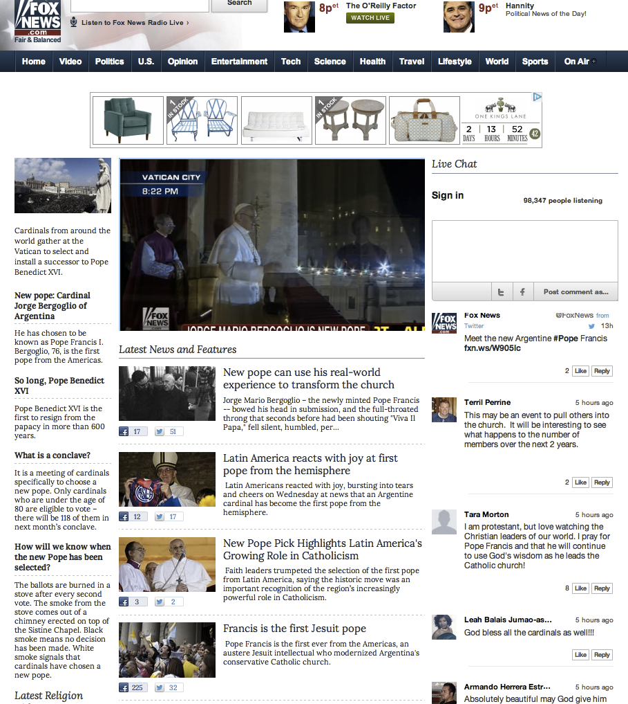

# Chat{#chat}

Chat in real time op uw sites inschakelen.

Chat staat publiek toe om in real time dialoog rond levende gebeurtenissen, aankondigingen of shows in te gaan. De inhoud wordt weergegeven als een continue stroom van chatten zonder threads om een snelle betrokkenheid mogelijk te maken en de activiteit op de pagina te versterken.

Fox News gebruikte Chat om de mening van het publiek en de reflectie over de verkiezing van paus Bergoglio vast te leggen. Fox News wist dat er een sterke toename van relevante en actieve deelname zou zijn, lanceerde binnen enkele minuten na de aankondiging een Chat om een onmiddellijk gesprek te creëren.

