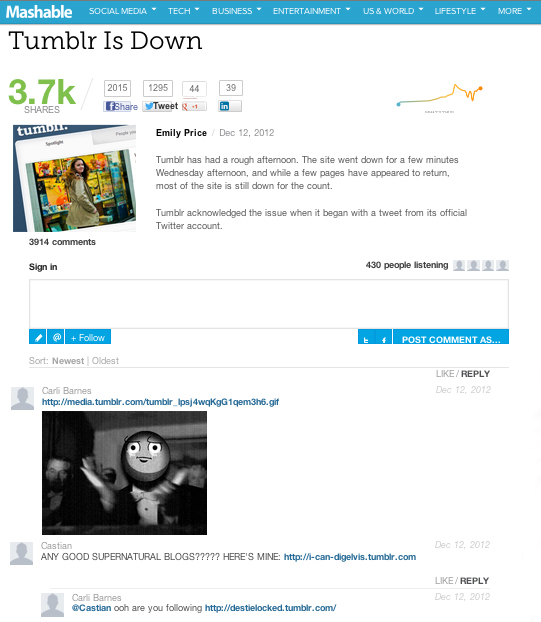

# Opmerkingen{#comments}

Real-time opmerkingen insluiten in uw app.

Met opmerkingen vervangt u uw standaardopmerkingen door real-time gesprekken. Dankzij onze sociale integratiefuncties is het eenvoudig om alle gesprekken over uw berichten op Twitter en Facebook vast te leggen en om de vrienden van de gebruiker in het gesprek te krijgen.

Mashable gebruikt Commentaren om gebruikersparticipatie in hun besprekingen te verhogen. Functies zoals het uploaden van rijke media, sociaal delen, het tellen van luisteraars en Single Sign-On helpen om het bijdragen aan het gesprek gemakkelijk en leuk te maken.

<!-- 

c_comments_app.dita

 -->

