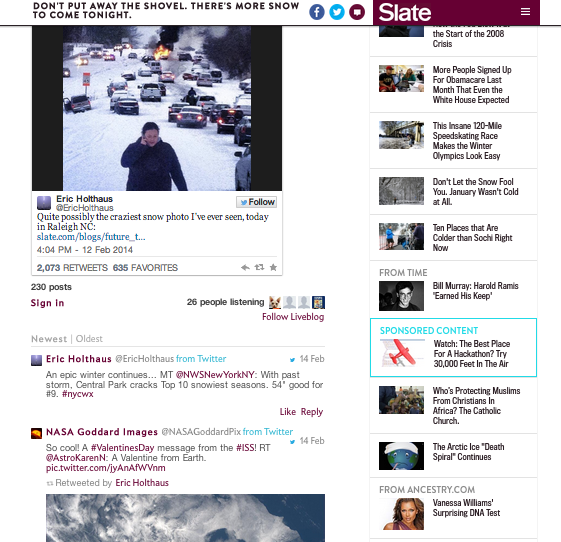

# Live blog{#live-blog}

Met Live Blog kunnen uw schrijvers en editors realtime updates posten, waardoor uw site wordt omgezet in een aantrekkelijke live nieuwsbron.

De berichten van uw team, rijk aan beelden, video, audio, en ingebedde inhoud, worden de bron voor nieuwe gesprekken en draden. Live Blog is ideaal als u het product publiceert, uitreikingsprogramma&#39;s en sportevenementen.

Live blog is op de volgende manieren anders dan opmerkingen:

* Alleen eigenaren en moderatoren kunnen het opmerkingsvak zien en functies op het hoogste niveau maken.
* Antwoorden van gebruikers kunnen worden uitgeschakeld om alleen bloggers te laten ervaren.
* Gebruikers kunnen foto&#39;s schrijven, uploaden of ingesloten koppelingen posten vanaf hun computer of mobiele apparaat.
* Het font voor opmerkingen is groter en de avatars zijn kleiner om de nadruk op de inhoud te leggen.
* Avatars kunnen desgewenst worden uitgeschakeld.

Met een andere sneeuwstorm die eraan kwam, wilde Slate de lezers direct op de hoogte stellen van de wilde weerschommelingen aan de oostkust. Met behulp van een Live Blog konden Slate-editors direct updates over de storm delen, waaronder hun eigen foto&#39;s, tweets van gebruikers en informatie over de sneeuwval. Live Blog was zo nuttig dat het de voorpagina van de site van Slate maakte.

