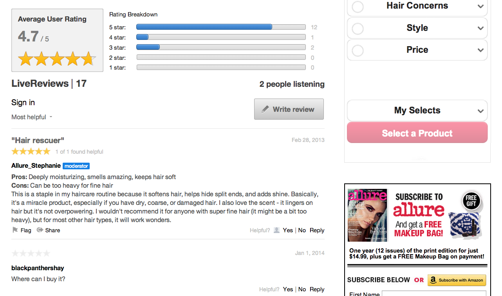

# Revisies{#reviews}

U kunt inhoud op uw website in real-time beoordelen en beoordelen.

Met revisies kunnen gebruikers eenvoudig producten, services, artikelen of inhoud op uw website in real-time beoordelen en beoordelen.

Elke revisie die in een Reviews-app wordt geplaatst, bestaat uit één regel, een body en een numerieke beoordeling. Door een Titel en een Classificatie op te nemen, kwantificeert Reviews App de mening van een gebruiker, en verstrekt een samenvatting van de ervaring van de gebruiker met dat product of de dienst.

De standaardToepassingen van Revisies bestaat uit een Inzameling van Revisies en een Summiere sectie die de Gemiddelde Onderverdeling van de Classificatie en de Classificatie van de Gebruiker voor de Inzameling toont. Gebruikers kunnen de revisies in real-time lezen en ermee communiceren.

Alle gebruikers kunnen in Revisies beoordelingen gebruiken om hun gebruikers uit te nodigen om beoordelingen en meningen over de producten die zij hebben, bij te dragen. Met Revisies kan Alure waardevolle en persoonlijke gebruikersfeedback van hun publiek vastleggen.

## Revisies-functies {#section_awq_xph_21b}

Revisies biedt verschillende functies die specifiek zijn voor deze app.

* Snelle visuele weergave van trends (sterrenwaarderingen en een samenvatting van de gemiddelde score) boven de stream.
* Aanpasbare beoordelingsinterface, waaronder het aantal sterren en hun afbeelding, de classificatiesubonderdelen (zoals Pro&#39;s en Cons) en meerdere ratingcategorieën.
* Geef een overzicht van revisies aan de hand van een grafische visualisatie van de gemiddelde beoordeling door de gebruiker en de onderverdelingen voor beoordelingen voor de verzameling revisies.
* De Revisies van de rij voor vertoning, terwijl het handhaven van het Overzicht van de gebruiker bij de bovenkant van de lijst voor hun mening.
* Gebruikers toestaan te stemmen over de nut van beoordelingen en vervolgens te sorteren op de meest nuttige en/of hoogste beoordeling.
* Mobiele interface.
