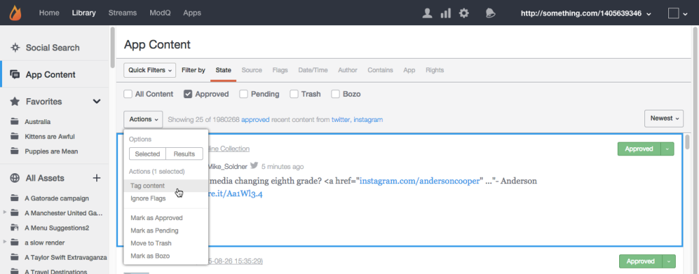
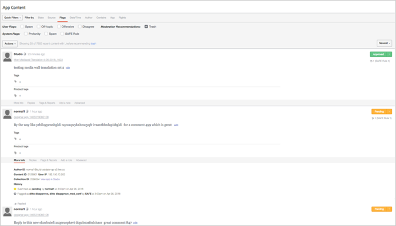
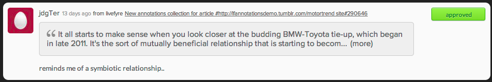

# Moderne inhoud met toepassingsinhoud{#moderate-content-using-app-content}

Op het tabblad App Content in uw bibliotheek kunt u inhoud die is gepubliceerd in uw apps, verkleinen.

## Moderne inhoud {#section_md5_sqm_zz}

Gebruik het deelvenster App Content om vermelde inhoud te modereren door de status te wijzigen, de status van de auteur te wijzigen of een notitie toe te voegen. Als u de inhoud wilt verkleinen, houdt u de muis boven de weergegeven inhoud om de beschikbare markeringen te wijzigen of gebruikt u het menu **[!UICONTROL pulldown]** om de status voor afzonderlijke of meerdere geselecteerde inhoud te wijzigen.

In App-inhoud kunt u:

* **[!UICONTROL Tag Content]**. Selecteer **[!UICONTROL Tag Content]** om codes toe te voegen aan afzonderlijke of meerdere stukken inhoud tegelijk.

* **[!UICONTROL Ignore Flags]**. Selecteer **[!UICONTROL Ignore Flags]** om geselecteerde inhoud uit te sluiten van de gemarkeerde resultaten van het onderzoeksfilter. Als u **[!UICONTROL Ignore Flags]** voor een item selecteert, verandert de status niet; het verwijdert het eenvoudig uit de onderzoeksresultaten voor dit onderzoeksfilter in de toekomst, voor alle gebruikers van Studio.

* **[!UICONTROL Change Content Status]**. Klik op een stuk inhoud en wijzig de status in het menu **[!UICONTROL Actions]**. (Gebruik de Command- of Control-toets om meerdere items te selecteren en gebruik vervolgens het menu om de status van meerdere inhoud tegelijk te wijzigen.)

   De opties zijn afhankelijk van de huidige status van de weergegeven inhoud.

   | Huidige status | Kan worden gewijzigd in |
   |---|---|
   | Goedgekeurd | In behandeling, prullenmand, Bozo |
   | Bozo | Goedgekeurd, in behandeling, prullenmand |
   | Prullenbak | Goedgekeurd, in behandeling, Bozo, Verwijderen |
   | In behandeling | Goedgekeurd, Prullenbak, Bozo |

* **[!UICONTROL Save as Assets]**. Selecteer **[!UICONTROL Save as Assets]** om het dialoogvenster Geavanceerde opties te openen. Hiervan kunt u de geselecteerde items opslaan in uw elementenbibliotheek, deze publiceren naar een app of hergebruiksrechten aanvragen bij de auteur.

* Matig gebaseerd op aanbevelingen. Gebruik **[!UICONTROL Moderation Recommendation Indicator]** in de Inhoud van de Toepassing om inhoud te filtreren die de matigingsaanbeveling als waarschijnlijk om identificeert te worden getrapt.

   In App Content zien de aanbevelingen van de matiging er als volgt uit:  

## Moderne seindingen {#section_i2s_nqm_zz}

Het werken met identificaties in het deelvenster Inhoud verschilt op verschillende manieren van het werken met andere typen inhoud:

* De tabbladen Meer informatie, Reacties, Markeringen en rapporten en Notitie toevoegen zijn niet beschikbaar.
* U kunt geen Sidenotes-inhoud labelen of markeren als aanbevolen.

Het verschil is ook dat het niet alleen de inhoud bevat die gemodereerd moet worden. Ook wordt de tekst weergegeven die is geselecteerd toen de Sidenote werd toegevoegd, zodat u de inhoud in de context kunt beoordelen.

Klik op het tekstvak om dit uit te vouwen, zodat het volledige door de gebruiker geselecteerde citaat wordt opgenomen.

De inhoudmatiging van Sidenotes staat zowel bulkveranderingen, als individuele statusveranderingen toe, zoals hierboven beschreven.

## Moderne Livefyre-gebruikers {#section_grw_mqm_zz}

Plaats de muis boven de gebruikersnaam voor een gebruiker van LiveCycle om een keuzemenu te openen, zodat u **[!UICONTROL Ban the User]** kunt opvragen, **[!UICONTROL More Info]** kunt ophalen of een lijst van hun **[!UICONTROL Comments]** kunt bekijken. Als u op dit menu klikt, wordt de infokaart van de gebruiker geopend op de pagina **[!UICONTROL Users]** van Studio.

Voor meer informatie over hoe te om gebruikers in **[!UICONTROL Users]** pagina te matigen, zie [Moderate Users ModQ](/help/using/c-features-livefyre/c-about-moderation/t-moderate-users-modq.md#t_moderate_users_modq).
