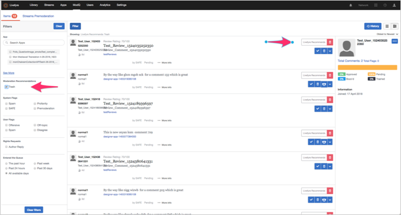

# VEILIGE regels{#safe-rules}

De Livefyre Spam en de Misbruik het Filtreren Motor (SAFE), is een achtergrondproces dat alle inkomende inhoud analyseert, en voor alle klanten van Livefyre toegelaten.

SAFE maakt gebruik van patroonregels en statistische modellen om spam, misbruik, onheil en bulkartikelen (herhaalde) op te sporen. U zult het van tijd tot tijd van verwijzingen zien in andere producten van het Levenslang, met name de hulpmiddelen van de moderatie van de Inhoud en ModQ.

>[!NOTE]
>
>SAFE is alleen in het Engels, behalve voor de indeling voor bulkmailing. Neem contact op met uw strategische accountmanager als u ondersteuning voor andere talen nodig hebt.

## Studio-componenten die gebruikmaken van VEILIG {#section_k34_4tx_vy}

De vlaggen die door SAFE worden toegepast kunnen met de volgende componenten van Studio worden gebruikt:

* Regels

   U kunt VEILIGE regels bepalen om inhoud automatisch te markeren en te bepalen hoe de gemarkeerde inhoud in **[!UICONTROL Network Settings]** zou moeten worden behandeld.

   Een site kan bijvoorbeeld een zeer lage tolerantie voor winstgevendheid instellen en VEILIGE regels definiëren die alle inhoud die als Winst wordt gemarkeerd, instellen op Bozo&#39;d. Andere plaatsen kunnen Regels bepalen die de inhoud van het Winst om voorgematigd te plaatsen alvorens de stroom in te gaan.

* ModQ

   U kunt inhoud die door de regels van de VEILIGHEID, en andere premoderatieregels (bijvoorbeeld, SPAM, rijkdom, enz.) wordt gemarkeerd, in ModQ matigen.

* App-inhoud in de bibliotheek

   Inhoud die is gemarkeerd door SAFE, wordt weergegeven in de inhoud van de app op het tabblad **[!UICONTROL Library]**. U kunt inhoud filteren door vlaggen om inhoud te matigen.

## Opties voor VEILIG filter {#section_pg5_ttx_vy}

SAFE past de volgende vlaggen op gefiltreerde inhoud toe en kan worden gebruikt om regels en gematigde inhoud van binnen Studio Livefyre tot stand te brengen.

* **[!UICONTROL Profanity List]**: Profielinhoud, zoals gedefinieerd door een lijst met Engelse trefwoorden, die is gebaseerd op algemeen gebruik.

   Met het filter Winstgevendheid zoekt u op basis van een geteste woordenlijst naar een profaantaal. Als dit wordt gedetecteerd, wordt de inhoud gemarkeerd met Profiel.

   >[!NOTE]
   >
   >Livefyre verstrekt ook een tweede filter van de Lijst van de Winstgevendheid, dat u op zowel de Niveaus van de Plaats als van het Netwerk kunt aanpassen. De regels die met de Rendementlijst worden gecreeerd zullen belangrijkheid over geautomatiseerde regels die uit het filter van de Winst van de VEILIGHEID voortvloeien. Raadpleeg de sectie Rendementenlijst in de documentatie bij Instellingen voor meer informatie.

* **[!UICONTROL Mild Profanity]**: Woorden en zinnen zijn in het algemeen niet acceptabel in beleefde gesprekken, maar zijn meestal acceptabel in willekeurige gesprekken. Over het algemeen zijn deze woorden en zinnen toegestaan op de televisie van het netwerk.
* **[!UICONTROL Strong Profanity]**: Zeer sterke taal, zoals expletives en woordgroepen die niet zijn toegestaan op netwerktelevisie en spaarzaam worden gebruikt in films met een R-rating en volgroeide kabeltelevisies. Over het algemeen worden deze woorden niet gebruikt in beleefd of incidenteel gesprek en worden ze in een onbeleefd gesprek gezegd met de bedoeling de listener te schaden.
* **[!UICONTROL SPAM]**: Ongevraagde, meestal commerciële inhoud. Er wordt een statistisch model gebruikt dat is gebaseerd op verschillende functies (waaronder inhoud van opmerkingen en URL&#39;s) om een stuk inhoud te markeren als SPAM. U kunt spamdrempels aanpassen om SPAM etiketterende tarieven voor uw netwerk of plaats, door verzoek aan te passen.
* **[!UICONTROL Mild Insult]**: Inhoud isoleren, zoals gedefinieerd door een lijst met trefwoorden en woordpatronen.
* **[!UICONTROL Strong Insult]**: Inhoud isoleren, zoals gedefinieerd door een lijst met trefwoorden en woordpatronen.
* **[!UICONTROL Hate Speech]**: Een belediging op grond van etniciteit of religie, met name wanneer de doelgroep zich in een minderheid bevindt of beschermd is.
* **[!UICONTROL ALL CAPS]**: Tekst die in alle hoofdletters wordt weergegeven (lezen als geel).
* **[!UICONTROL Mild Threat]**: Een bedreiging of belediging die meestal een soort milde wreedheid tegen iemand anders bevat. Deze optie markeert vaker mogelijke bedreigingen, maar heeft ook een hoger fout-positief tarief dan **[!UICONTROL Strong Threat]**.

* **[!UICONTROL Strong Threat]**: Een ernstige bedreiging of belediging die stelt dat een of meer mensen lichamelijk letsel kunnen oplopen, vaak met een sterke grove belediging. Deze optie markeert mogelijke bedreigingen minder vaak, maar heeft ook een lager vals-positief tarief dan **[!UICONTROL Mild Threat]**.

* **[!UICONTROL Probable Nudity]**: Een afbeelding die nuchterheid kan hebben. Deze optie markeert nudity minder vaak, maar heeft ook een lager fout-positief tarief dan **[!UICONTROL Possible Nudity]**.

* **[!UICONTROL Possible Nudity]**: Een afbeelding die nuchterheid kan hebben. Deze optie markeert nuditeit vaker, maar heeft ook een hogere fout-positieve snelheid dan **[!UICONTROL Probable Nudity]**.

* **[!UICONTROL PII]** (Persoonlijk identificeerbare informatie): Informatie die de gebruiker kan identificeren. Dit kan een e-mailadres, fysiek adres, socialezekerheidsnummer (voor klanten in de VS), creditcardnummer, wachtwoord of iets anders zijn dat in fraude kan worden gebruikt of de identiteit van iemand kan verkrijgen.
* **[!UICONTROL Livefyre Recommends Trash]**. Plaats de actie die het systeem uitvoert wanneer de geautomatiseerde Aanbeveling van de Moderatie inhoud voor verwerping identificeert.  

   >[!NOTE]
   >
   >Neem contact op met uw Adobe Livefyre-supportprofessional om Moderation Recommendations in te schakelen.

## Inhoud verwerken die niet door VEILIG {#section_pjy_5tx_vy} wordt afgevangen

Er zijn verschillende manieren beschikbaar om inhoud die niet door dit filter wordt afgevangen, effectief af te handelen. De onderstaande opties staan in de aanbevolen volgorde van het proces.

1. Als moderator, verwijder de inhoud uit de stroom.
1. Maak een vlagregel die aangeeft of een stuk inhoud door vijf gebruikers is gemarkeerd als Spam of Aanvallend, en stel deze in op Bozo.
1. Verbod de gebruiker die ongewenste inhoud post, zodat al hun inhoud direct in de staat Bozo gaat.
1. Voeg specifieke woorden toe die altijd moeten worden gefilterd in uw lijst met eigenschappen.

>[!NOTE]
>
>Als een moderator inhoud post die door ons filter van het Spam wordt gevangen, wordt het nog gemarkeerd als Spam, maar automatisch goedgekeurd, en zal niet aan Bozo worden geplaatst.

Als u trends of patronen van inhoud opmerkt die niet wordt afgevangen door VEILIG, verzendt u een e-mail naar uw CSM&#39;s met de opmerkingen-id&#39;s en tekst.

Toepassingen die deze functie gebruiken:

* [Carousel](/help/using/c-about-apps/c-carousel-app/c-carousel-app.md#c_carousel_app)
* [Chat](/help/using/c-about-apps/c-chat-app/c-chat-app.md#c_chat_app)
* [Opmerkingen](/help/using/c-about-apps/c-comments/c-comments.md)
* [Functiekaart](/help/using/c-about-apps/c-feature-card-app/c-feature-card-app.md#c_feature_card_app)
* [Kaart](/help/using/c-about-apps/c-map-app/c-map-app.md#c_map_app)
* [Mediumwand](/help/using/c-about-apps/c-media-wall-app/c-media-wall-app.md#c_media_wall_app)
* [Mozaïek](/help/using/c-about-apps/c-mosaic-app/c-mosaic-app.md#c_mosaic_app)
* [Revisies](/help/using/c-about-apps/c-reviews-app/c-reviews-app.md#c_reviews_app)
* [Sidenotes](/help/using/c-about-apps/c-sidenotes-app/c-sidenotes-app.md#c_sidenotes_app)
* [Storiseren 2](/help/using/c-about-apps/c-storify2/c-storify2.md#c_storify2)
* [Knop Uploaden](/help/using/c-about-apps/c-upload-button-app/c-upload-button-app.md#c_upload_button_app)

