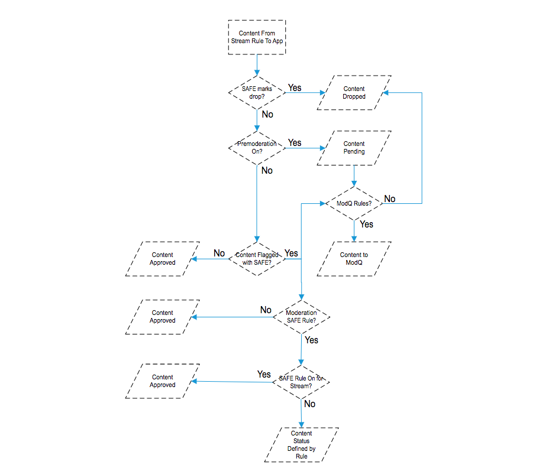
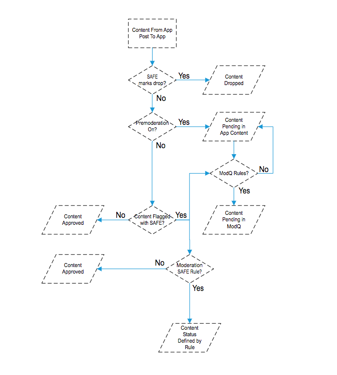
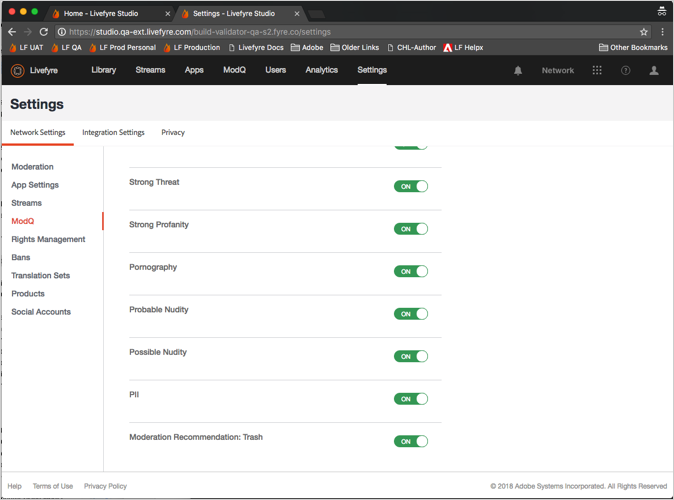
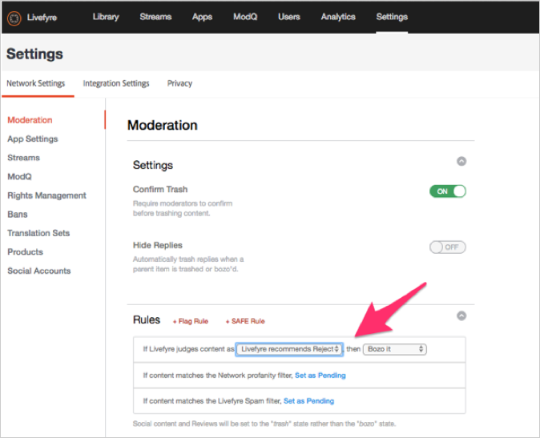
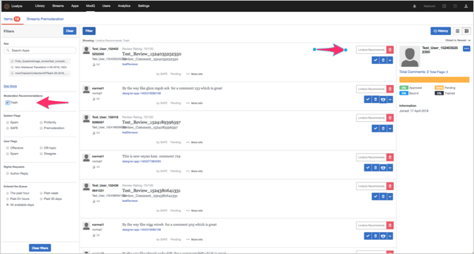

# Moderatie instellen{#setting-up-moderation}

Gebruik het lusje van de Moderatie om premoderatieregels voor inkomende inhoud, met inbegrip van woekerlijsten, vlagregels, en verboden IP adressen te plaatsen.

## Hoe Moderatie werkt {#section_kyf_gvc_t1b}

U kunt inhoud op de volgende manieren verkleinen:

* Inhoud automatisch vooraf comprimeren om ongewenste inhoud uit te filteren op basis van regels die u instelt voordat u de inhoud publiceert.
* Verwijder of keur handmatig inhoud goed die is gemarkeerd met de automatische premoderatie met de ModQ- of App-inhoud in de bibliotheek.
* Identificeer sitebezoekers die herhaaldelijk aanstootgevende inhoud plaatsen om te voorkomen dat ze deze posten door specifieke Livefyre-gebruikers, sociale gebruikers of IP-adressen te verbieden.
* Identificeer mensen en inhoud die altijd kunnen tonen door het fluiten van gebruikers of het uitzetten van filters voor specifieke stromen, plaatsen, of netwerken.

U kunt inhoud automatisch op de volgende manieren premodereren:

* Stel regels in om bepaalde typen inhoud automatisch te markeren:

   * Vlagregels instellen voor inhoud die is gemarkeerd door de vlag voor sitebezoekers **[!UICONTROL Settings > Moderation > Rules]**
   * VEILIGE regels instellen met **[!UICONTROL Settings > Moderation > Rules]**
   * Specifieke Twitter-gebruikers verbieden met **[!UICONTROL Settings > Streams]**
   * IP-adressen verbieden met **[!UICONTROL Settings > Bans]**
   * IP-regio&#39;s per landcode op verzoek verbieden. Geboden inhoud wordt gemarkeerd als SPAM.

* Maak een lijst met woorden die u als gewin beschouwt in de lijst Rentabiliteit onder **[!UICONTROL Settings > Moderation > Rules]** voor uw netwerk of site.
* Whitelist-gebruikers (mogen inhoud van deze gebruikers altijd weergeven) door filters voor specifieke streams, sites of netwerken te gebruiken of uit te schakelen.

Nadat u de dieptelijsten, de filters van de VEILIGHEID, en de regels hebt opgesteld, kunt u verkiezen of om inhoud te premodereren en de filters van de VEILIGHEID in stromen toe te passen. Zie Opties [stroomregel voor alle stroomregels](/help/using/c-streams/c-stream-rule-options-for-all-stream-rules.md#c_stream_rule_options_for_all_stream_rules)voor meer informatie.

In LiveCycle wordt inhoud gemarkeerd als **[!UICONTROL Approved]**, **[!UICONTROL Pending]**, **[!UICONTROL Junk]** enzovoort. afhankelijk van waar de inhoud vandaan komt, waar deze wordt gepubliceerd en welke regels u in uw systeem hebt ingesteld. In de volgende tabel worden de acties beschreven die Livefyre, afhankelijk van deze factoren, in detail uitvoert.

## Hoe Moderatie werkt

| Inhoud komt van: | Inhoud verzenden naar: | Goedkeuringsstatus |
|--- |--- |--- |
| Bibliotheek | App | Inhoud goedgekeurd |
| Sociale zoekfunctie | App | Inhoud goedgekeurd |
| Streepjesregel | App | Is de inhoud door het filter VEILIG gemarkeerd als Gebrok?  <ul><li>No - Stream-to-App Moderation Workflow</li><li>Ja - Inhoud is opgeschoond</li></ul> |
| Bibliotheek | Map | Geen status (in map, niet gepubliceerd, niet getrapt) |
| Sociale zoekfunctie | Map | Geen status (in map, niet gepubliceerd, niet getrapt) |
| Streepjesregel | Map | Is de inhoud door het filter VEILIG gemarkeerd als Gebrok?  <ul><li>Nee - geen status (in map, niet gepubliceerd, niet getrapt)</li><li>Ja - Inhoud is opgeschoond</li></ul> |
| App Post | App | Is de inhoud door het filter VEILIG gemarkeerd als Gebrok?  <ul><li>No - Post-to-App Moderation Workflow</li><li>Ja - Inhoud is opgeschoond</li></ul> |

## Workflow voor streamings-naar-app moderatie {#section_z5z_w4d_t1b}

Voordat de inhoud van een stream naar een app wordt gepubliceerd, voert LiveCyre de volgende controles uit om te bepalen wat er met de inhoud moet gebeuren:

1. Als de inhoud met de vlag SAFE wordt gemarkeerd als junk of drop, wordt de inhoud door LiveCyre overgeslagen.
1. Als SAFE de inhoud niet als junk markeert, controleert Livefyre of premoderatie is.
1. Als de premoderatie is ingeschakeld, markeert Livefyre de inhoud als in behandeling.
1. Als u regels ModQ instelt, dan verzendt Livefyre de inhoud naar ModQ.
1. Als premoderatie niet is ingeschakeld, controleert LiveCyre of de inhoud is gemarkeerd met SAFE.
1. Als de inhoud met de vlag SAFE is gemarkeerd, keurt LiveCyre de inhoud goed en publiceert het de inhoud naar de app.
1. Als SAFE de inhoud markeert en u geen VEILIGE regels opstelde, dan keurt Livefyre de inhoud goed en publiceert de inhoud naar App.
1. Als de VEILIGE vlaggen de inhoud en u opstelling VEILIGE regels, Levenslang controleert als u de regels van de opstelling VEILIGE voor de Stroom.
1. Als u SAFE-regels instelt voor de stream, keurt Livefyre de inhoud goed en publiceert het de inhoud naar de app. Als u geen VEILIGE regels voor de stroom opstelde, gebruikt Livefefyre de regels van de moderatieVEILIGE om te bepalen hoe te om de inhoud te behandelen (verzend naar ModQ, afval, enz.).

## Workflow voor postapp-moderatie {#section_fwn_w4d_t1b}

Voordat de inhoud van een App-bericht naar een app wordt gepubliceerd, voert LiveCyre de volgende controles uit om te bepalen wat er met de inhoud moet gebeuren:

1. Als het filter VEILIG de inhoud als neerzetten markeert, laat Livefyre de inhoud vallen.
1. Als SAFE de inhoud niet als daling markeert, controleert Livefyre of is premoderatie. Als de premoderatie is ingeschakeld, markeert Livefyre de inhoud als in behandeling. Als u ModQ-regels instelt, verzendt LiveCyre de inhoud naar ModQ als in behandeling. Als dat niet het geval is, blijft de inhoud in de bibliotheek in afwachting van de status in de App Content.
1. Als premoderatie niet is ingeschakeld, controleert LiveCyre of de inhoud is gemarkeerd met SAFE. Als dat niet het geval is, keurt Livefyre de inhoud goed en publiceert het de inhoud naar de app.
1. Als de VEILIGE vlaggen de inhoud en u opstelling de regels van de VEILIGHEID markeert, gebruikt Livefyre de VEILIGE regel om te bepalen hoe te om de inhoud te behandelen (verzend naar ModQ, afval, enz.). Als SAFE de inhoud markeert en u geen VEILIGE regels opstelde, dan keurt Livefyre de inhoud goed en publiceert de inhoud naar App.

## Bulkfilters {#section_lyk_ktx_vy}

Met het filter Bulk zoekt u naar herhaalde inhoud die binnen een korte tijdsperiode op alle LiveCycle-netwerken wordt geplaatst. Als deze inhoud wordt gedetecteerd, wordt deze als Bulk gemarkeerd en standaard wordt deze inhoud getrapt. Weliswaar wordt door de gebruiker bulkinhoud gegenereerd (bijvoorbeeld &quot;Touchdown!&quot;) De meeste van deze wedstrijden worden herhaaldelijk in een Chat geplaatst tijdens een populair voetbalspel. Dit filter is taalonafhankelijk en werkt met elke taal. Als u het bulkfilter wilt aanpassen, moet u contact opnemen met de ondersteuning van LiveCycle.

## Regels {#section_gqz_ksk_f1b}

Gebruik de sectie van Regels om pre-moderatieregels tot stand te brengen, die op VEILIG en gebruiker toegepaste vlaggen worden gebaseerd. Dit paneel biedt twee soorten regels:

* **[!UICONTROL Flag Rules:]** Geef een actie op die moet worden uitgevoerd op een opmerking die door gebruikers een bepaald aantal keren is gemarkeerd.
* **[!UICONTROL SAFE Rules:]**VEILIGE vlaggen combineren met acties om de gemarkeerde inhoud over te nemen.

Als u Vlagregels wilt maken, selecteert u de markering (Aanstootgevend, Van onderwerp, Niet akkoord of Spam), geeft u het aantal keren op dat deze op een stuk inhoud moet worden toegepast en selecteert u de actie die u wilt uitvoeren. U kunt één vlagregel instellen voor elke vlagoptie (Aanstootgevend, Uit Onderwerp, Niet akkoord of Spamma).

U kunt regels op de niveaus van het Netwerk, van de Plaats, en van de Stroom tot stand brengen. Regels op het niveau van de plaats erven netwerkregels, tenzij u de regels van de Plaats verschillend vormt. De regels van de stroom erven de regels van de Plaats tenzij u hen verschillend vormt.

Beschikbare acties:

* **[!UICONTROL Trash it:]**stuurt de gemarkeerde opmerking naar de prullenbak.
* **[!UICONTROL Bozo it:]** Hiermee verbergt u de gemarkeerde opmerking van alle gebruikers, met uitzondering van de schrijver, aan wie deze zichtbaar blijft.
* **[!UICONTROL Pending:]** stelt de inhoud in als in behandeling. Als u Premoderatie aan onder plaatst, dan zal het in ModQ zijn. **[!UICONTROL Settings > ModQ]** Anders is dit alleen in App Content.

>[!NOTE]
>
>Livefefyre raadt u aan regels voor Bozo-opmerkingen te maken die door vijf gebruikers zijn gemarkeerd als Spam of Aanstootgevend.

## Aanbevelingen voor modernisering {#section_ec3_vr3_2cb}

U kunt aanbevelingen voor moderatie gebruiken om u te helpen bepalen hoe te om inhoud te matigen die door plaatsbezoekers in Apps Livefyre wordt geplaatst. De indicator van de Aanbeveling van de Moderatie adviseert wanneer een stuk van inhoud waarschijnlijk zal worden gesloopt, gebaseerd op welke acties u eerder over gelijkaardige inhoud nam. Aanbevelingen voor moderatie gebruiken:

1. Schakel de functie Moderation Recommendations in door contact op te nemen met uw Adobe LiveCyre-supportprofessional.
1. De aanbevelingen van de opstellingsmoderatie in de Montages van het Netwerk.

   Stel moderatie-aanbevelingen in met behulp van de **[!UICONTROL Livefyre Recommends Trash]** instelling onder **[!UICONTROL Network Settings]**.

   

1. Opstelling een VEILIGE regel om Livefyre te vertellen wat met inhoud te doen die de matigingsaanbeveling als inhoud identificeert die waarschijnlijk zal worden gesloopt. Voor meer informatie over hoe te opstelling een VEILIGE regel voor de **[!UICONTROL Livefyre Recommends Trash]** optie, zie [Moderatie](/help/using/c-features-livefyre/c-about-moderation/c-moderation.md#c_moderation).

   

1. Gebruik de code **[!UICONTROL Moderation Recommendation Indicator]** in ModQ of in App Content om inhoud te filteren die volgens de moderatieaanbeveling waarschijnlijk zal worden getrapt.

   In ModQ ziet de indicator er als volgt uit:  

   Voor meer informatie over hoe te om de Aanbevelingen van de Moderatie te gebruiken om inhoud in ModQ te matigen, zie [ModQ](/help/using/c-features-livefyre/c-about-moderation/c-modq.md#c_modq).

   In App Content zien de aanbevelingen van de matiging er als volgt uit:  

   Voor meer informatie over hoe te om de Aanbevelingen van de Moderatie in de Inhoud van de Toepassing te gebruiken, zie [Moderne Inhoud Gebruikend de Inhoud](/help/using/c-features-livefyre/c-about-moderation/c-moderate-content-using-app-content.md#c_moderate_content_using_app_content)van de Toepassing.
