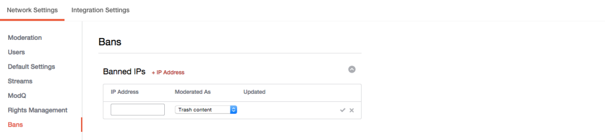

# IP-adressen blokkeren{#ban-ip-addresses}

U kunt IP adressen verbieden als een kwaadwillige gebruiker veelvoudige rekeningen van het zelfde IP adres creeert.

Als een verboden gebruiker begint te beseffen dat niemand zijn opmerkingen ziet, kan hij of zij besluiten een nieuwe gebruikersaccount te maken met een andere gebruikersnaam en avatar en vervolgens onjuiste of spamopmerkingen te plaatsen van deze nieuwe, niet-verboden account. Uw moderatoren kunnen de inhoud als de zelfde gebruiker erkennen, en deze veronderstelling verifiëren door het IP adres van de gebruiker te controleren die de commentaren (van de pagina van Details van de Rekening) posten.

1. Klik in **[!UICONTROL + IP Address]** het paneel Verboden IPs.
1. Ga het IP Adres op het gebied in. Om een waaier van IP adressen te verbieden, ga de waaier in het formaat &quot;192.168.0.1 - 192.168.0.10&quot;(afzonderlijke IP adressen door ruimten en een streepje allen in citaten) in en klik **[!UICONTROL Save]**.
1. Selecteer een actie in het keuzemenu (Prullenbak, Prematig of Bozo-inhoud).
1. Klik op het vinkje dat u wilt opslaan.
