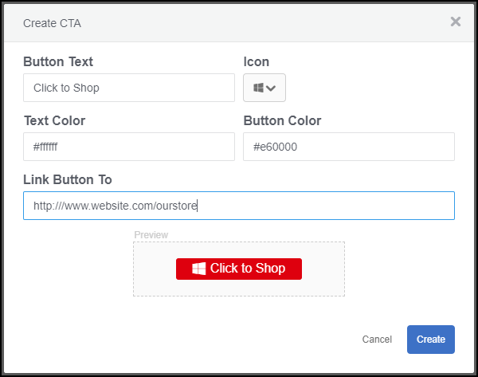
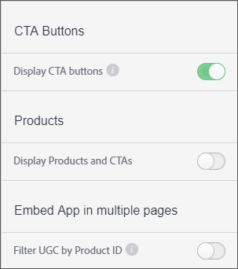

# Aangepaste oproep tot actie-knop{#custom-call-to-action-button}

## Aangepaste oproep tot actie-knop {#topic_EBE23A0F827645E0A0C619DCF3872EE5}

Aangepaste CTA-knoppen (Call-to-Action) zijn knoppen die aan elk element in LiveCycle Studio kunnen worden toegevoegd om de inhoud actioneerbaar te maken. Ze kunnen een eindgebruiker verwijzen naar elke aangepaste URL, zoals een pagina met sociale media of een winkelwagentje. De knopen CTA kunnen in veelvoudige plaatsen in Livefyre worden gecreeerd, maar zij worden beheerd binnen de **[!UICONTROL Settings]** sectie van LiveCycle Studio.

Met Aangepaste CTA&#39;s kunt u:

* Voeg aangepaste CTA knopen aan om het even welk stuk van UGC in uw Livefyre media muren, mozaïeken, karrousels, filmstroken, en op individuele eigenschapkaarten toe.
* U kunt het bericht, de pictogrammen, kleuren, koppelingen en het aantal knoppen op elk onderdeel van de UGC beheren.
* Maak, beheer en gebruik aangepaste CTA-knoppen vanuit Instellingen en de Bibliotheek.
* Gebruik Adobe Analytics om doorkliksnelheden te meten.

## Creeer een Douane Vraag-aan-Actie Knoop {#task_C61B4A8E66F24AC19C833612E596B736}

Taakcontext

1. Klik in LiveCycle Studio op **[!UICONTROL Settings]**.
1. Klik in de linkertrack op **[!UICONTROL CTAs]**.

   De bibliotheek CTA zal verschijnen, waar CTAs binnen omslagen kan worden gecreeerd en worden georganiseerd. 1. Klik op **[!UICONTROL Create CTA]**.
1. Vul de gebieden met de gewenste aanpassingen in en een knoopvoorproef zal bij de bodem van het Create CTA scherm teruggeven.

   

1. Klik op **[!UICONTROL Create]**.

   De knop CTA kan nu aan elk element worden toegevoegd.

## Voeg een Knoop van de Vraag-aan-Actie van de Douane aan een Activum {#task_36190DD1C8204C7793CB7EEA379C2155} toe

Voeg een knoop CTA aan om het even welk stuk van inhoud in Studio Livefyre toe.

1. Navigeer in de Livefyre-studio naar **[!UICONTROL Library]** > **[!UICONTROL All Assets]**.
1. Selecteer op één of meerdere activa waarin om een knoop CTA toe te voegen.
1. Klik op **[!UICONTROL CTAs]**.

   

1. Selecteer de gewenste knoop CTA van de lijst, dan klik **[!UICONTROL Add]**.

   De knop CTA wordt nu weergegeven op het geselecteerde element.

   >[!NOTE]
   >
   >Als u de aangepaste CTA&#39;s die u aan elk element koppelt, in een app wilt weergeven, moet u CTA-knoppen inschakelen in de App-instellingen:
   >
   >
