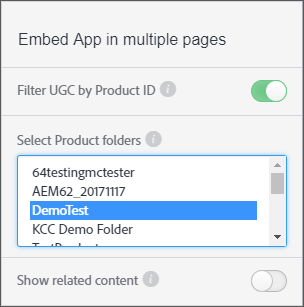

# UGC filteren op product-id {#filter-ugc-product-id}

Door UGC te filteren op product-id kunt u exact dezelfde app op meerdere pagina&#39;s insluiten en tegelijkertijd verschillende productspecifieke UGC voor elke pagina weergeven.

Voer de volgende stappen uit om UGC te filteren op product-id:

1. Navigeer in LiveCycle Studio naar het **[!UICONTROL Apps]** tabblad.

1. Selecteer de app die u wilt wijzigen.

1. Selecteer het tabblad Designer in de linkerrails.

1. Inschakelen **[!UICONTROL Filter UGC by Product ID]**.



1. Selecteer de productmappen op het hoogste niveau waarin de producten staan die u wilt filteren op UGC.
Gebruik CTRL/Command + klik om meerdere mappen te selecteren.

1. Uitschakelen **[!UICONTROL Show related content]**.
Als deze optie is ingeschakeld, wordt inhoud die met het `data-lf-attr-product` kenmerk is gefilterd eerst weergegeven, gevolgd door alle andere inhoud in de app.

1. Klik op **[!UICONTROL Publish]**.

1. Voeg de product-id&#39;s waarop u wilt filteren in de resulterende code in.

>[!NOTE]
>
>Navigeer naar product-id&#39;s om deze te zoeken. **[!UICONTROL Settings > Products]** Zoek het gewenste product en selecteer het en de id wordt weergegeven.

De volgende code wordt bijvoorbeeld gegenereerd voor een Media Wall App:

```
<script type="text/javascript" src="https://cdn.livefyre.com/
Livefyre.js"></script><div class="lf-app-embed" data-lfapp="
59dc41fa-85a5-49ed-8d60-d74616b3ccd1/tagged/published" datalf-
env="prod" data-lf-read-only="" data-lf-attr-product="<product
 1>,<product 2>"></div><script>Livefyre.require(["app-embed#1.0.11"],
 function (appEmbed) {appEmbed.loadAll().done(function(embed)
 {embed = embed[0];if (embed.el.onload && embed.getConfig)
 {embed.el.onload(embed.getConfig());}});});</script>
```

Als u een product van een label wilt voorzien, vervangt u het `<product 1>` `data-lf-attr-product` kenmerk door de gewenste product-id. U kunt een product of meer labelen door extra product-id&#39;s met komma&#39;s als scheidingsteken toe te voegen. De producten moeten binnen de top-level productomslag of de omslagen worden bevat die in Stap 5 worden geselecteerd.

Het gewijzigde codesegment wordt weergegeven als:

```
<script type="text/javascript" src="https://cdn.livefyre.com/
Livefyre.js"></script><div class="lf-app-embed" data-lfapp="
59dc41fa-85a5-49ed-8d60-d74616b3ccd1/tagged/published"
 data-lf-env="prod" data-lf-read-only="" data-lf-attrproduct="
109,47"></div><script>Livefyre.require(["app-embed#1.0.11"],
 function (appEmbed) {appEmbed.loadAll().done(function(embed)
 {embed = embed[0];if (embed.el.onload && embed.getConfig)
 {embed.el.onload(embed.getConfig());}});});</script>
```

De app geeft nu alleen de gelabelde product-id&#39;s weer.