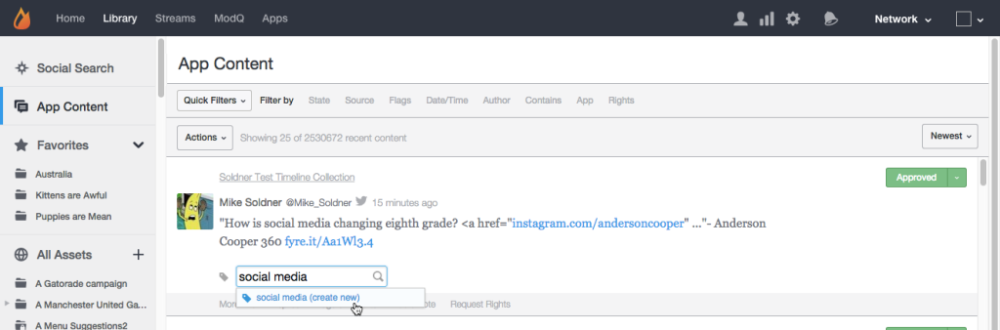

# Tabblad App-inhoud{#app-content-tab}

Inhoud beheren in uw LiveCycle-netwerk.

Op het tabblad App Content in uw bibliotheek kunt u zoeken naar inhoud die in uw apps is gepubliceerd en deze inhoud modereren. De **[!UICONTROL App Content]** kunt u met meerdere zoekfilters zoeken op basis van jokertekens, zodat u sneller en gemakkelijker zoekparameters kunt definiëren.

Gebruik het tabblad App Content om:

* Inhoud zoeken
* Inhoudsgeschiedenis weergeven
* Moderne inhoud
* Een tag toevoegen
* Inhoud onderdeel
* Inhoud koppelen aan producten uit de productcatalogus

Ga voor meer informatie over het verkleinen van inhoud via het tabblad App Content naar [Moderne inhoud met tabblad App Content](../c-features-livefyre/c-about-moderation/c-moderate-content-using-app-content.md#c_moderate_content_using_app_content).

## Zoeken met jokertekens {#section_jvr_ntm_zz}

Live zoekvelden ondersteunen jokertekens, waarmee u een sterretje ( * ) aan woorden (of woordfragmenten) kunt toevoegen om gedeeltelijke overeenkomsten af te vangen.

Bijvoorbeeld:

* ball geeft alleen ball
* ball* geeft bal en ballon
* *ball retourneert bal en voetbal
* *ball* geeft bal en uniball en sneeuwballon

## Inhoud zoeken {#section_fw1_mtm_zz}

In het deelvenster App Content kunt u uw zoekopdracht beperken met behulp van verschillende filteropties voor inhoud.

Gebruik de **[!UICONTROL Quick Filters]** pulldown aan smalle teruggekeerde inhoud aan **[!UICONTROL All Content]**, **[!UICONTROL All Sidenotes]**, **[!UICONTROL Approved]**, **[!UICONTROL Approved & Flagged]**, **[!UICONTROL Pending]**, of **[!UICONTROL Rights Requests]** status. Selecteer vervolgens een **[!UICONTROL Filter by]** en gebruik de selectievakjes of invoervelden die beschikbaar zijn om uw zoekopdracht te verfijnen.

Gebruik het keuzemenu om de inhoud in de lijst te sorteren op **[!UICONTROL Newest]**, **[!UICONTROL Oldest]**, **[!UICONTROL Recently updated]**, **[!UICONTROL Most flags]** of **[!UICONTROL Most liked]**.

## Filteren op opties {#section_aqn_xqm_zz}

Gebruik de **[!UICONTROL Filter by]** bar aan filter door de volgende opties:

* **Staat** Hiermee kunt u filteren op de huidige moderatiestatus van de inhoud:** [!UICONTROL All Content]**, **[!UICONTROL Approved]**, **[!UICONTROL Pending]**, of **[!UICONTROL Bozo]**.

* **Bron** Hiermee kunt u filteren op de bron van de inhoud. Selecteren **[!UICONTROL Livefyre]** om door de gebruiker gegenereerde inhoud weer te geven die rechtstreeks in de stream is geplaatst. Selecteren **[!UICONTROL Facebook]**, **[!UICONTROL Twitter]**, of **[!UICONTROL RSS]** om inhoud op te nemen die vanuit deze bronnen in uw apps is opgehaald.

* **Vlaggen** Als u Vlaggen selecteert, kunt u filteren op **[!UICONTROL User Flags]** (Spam, Off-topic, Aanval, of Niet akkoord), **[!UICONTROL System Flags]** toegepast door VEILIGHEID (Winstgevendheid, Spam, of Magisch Gematigd), of **[!UICONTROL Moderation Recommendations]**. 

* **Datum/tijd** Hiermee kunt u filteren op het tijdstip waarop de inhoud oorspronkelijk werd gemaakt **[!UICONTROL Created]** (of naar de app gehaald via SocialSync of een Stream), of als laatste **[!UICONTROL Modified]** (bewerkt, gemarkeerd of het gewijzigde frame).

* **Auteur** Hiermee kunt u filteren op de naam van de auteur **[!UICONTROL IP]** adres, **[!UICONTROL Display Name]** (te vinden in het deelvenster Gebruikers of van boven de inhoud die door de auteur is gepost), of **[!UICONTROL User ID]**(beschikbaar in het deelvenster Gebruikers).

* **Bevat** Hiermee kunt u de meest recente 90 dagen inhoud filteren op **[!UICONTROL Keyword]** of **[!UICONTROL Content Tag]**. Selecteer **[!UICONTROL Media]** Schakel dit selectievakje in om alleen inhoud met Media te retourneren. (Als u naar alle inhoud wilt zoeken, schuift u omlaag door alle inhoud in de lijst en klikt u op **[!UICONTROL Search full data]**.)

   **Opmerking:** Het zoeken naar meerdere trefwoorden en inhoudscodes wordt niet ondersteund. Als er meerdere trefwoorden of tags zijn ingevoerd, wordt het laatste woord gebruikt voor de zoekopdracht.

   Als u op Inhoud-tag zoekt, worden voorgestelde tags automatisch ingevuld wanneer u in het zoekveld typt. De zoekresultaten retourneren alle inhoud waaraan ooit de tag is toegewezen. (Gebruik dit veld om naar aanbevolen inhoud te zoeken of klik op de knop **[!UICONTROL Featured]** label op alle aanbevolen inhoud in Studio.)

   **Opmerking:** Gebruik een minteken (-) vóór een labelnaam om te zoeken naar inhoud die die tag niet bevat. Bijvoorbeeld: Zoek naar &#39;-Miley&#39; om naar alle inhoud te zoeken die niet de &quot;Miley&quot;-tag bevat.

* **App** Hiermee kunt u filteren op **[!UICONTROL Collection ID]**, **[!UICONTROL App Tag]**, of **Bovenliggende id**. Filteren op bovenliggende id retourneert alle inhoud die een antwoord is op de invoer-inhoud-id. (Filteren op meerdere tags door tags in te voeren die worden gescheiden door een komma.)

* **Rechten** Hiermee kunt u filteren op de status Rechtenverzoeken:** [!UICONTROL Requested]**, **[!UICONTROL Granted]**, **[!UICONTROL Replied]**, of **[!UICONTROL Expired]**.

## Bozo-inhoud {#section_afl_vqm_zz}

In toepassingen **[!UICONTROL Bozo]** inhoud wordt alleen weergegeven aan de auteur van de inhoud. Hierdoor kan de gebruiker geloven dat de inhoud ervan is goedgekeurd, terwijl deze voor alle andere gebruikers en moderatoren wordt verborgen.

>[!NOTE]
>
>Sociale inhoud die afkomstig is van SocialSync of Streams **[!UICONTROL cannot]** worden ingesteld op Bozo.

U kunt Bozo-inhoud om de volgende redenen gebruiken:

* Inhoud die door SAFE als spam wordt aangeduid, wordt automatisch ingesteld op de status Bozo.
* Alle inhoud van Verboden gebruikers wordt automatisch ingesteld op Bozo.
* Inhoud kan van Studio Bozo worden gemarkeerd.
* Moderatoren kunnen Bozo-inhoud rechtstreeks in de stream opnemen.

## Inhoudsgeschiedenis weergeven {#section_ayz_tqm_zz}

In het deelvenster Inhoud kunt u de geschiedenis van alle vermelde inhoud controleren, inclusief voormatiging, spamfiltering, postdatum en eventuele gebruikersmarkeringen of notities die aan het item zijn toegewezen.

Met de tabbladen onder aan het inhoudspaneel kunt u de historie van het deelvenster weergeven.

* **[!UICONTROL More Info:]** geeft een lijst weer van alle activiteit op deze inhoud, met inbegrip van voorlegging, het uitgeven, spamcontrole, staatsverandering, en nota&#39;s. De livefyre Inhoud identiteitskaart en het IP van de gebruiker adres worden ook getoond in deze sectie.
* **[!UICONTROL Replies:]** bevat maximaal zes reacties. Klikken **[!UICONTROL Show all replies]** om alle reacties op de post weer te geven.

* **[!UICONTROL Flags & Reports:]** bevat een lijst met alle vlaggen van gebruikers, met de avatar van de gebruiker die de inhoud heeft gemarkeerd, en eventuele rapporten (notities die door de gebruiker zijn toegevoegd bij het markeren van de inhoud).
* **[!UICONTROL Add a note:]** staat u toe om een nota toe te voegen, zichtbaar aan andere Admins of Moderators.
* **[!UICONTROL Request Rights:]** opent de **[!UICONTROL New Rights Request]** , waarvan een verzoek om rechten kan worden gedaan.

* **[!UICONTROL Save as Asset:]**opent de **[!UICONTROL Advanced Options]** , waarmee u het geselecteerde item kunt opslaan in uw elementenbibliotheek, publiceren naar een app of hergebruiksrechten van de auteur kunnen aanvragen.

## Een label toevoegen aan inhoud {#section_xb4_mxr_rdb}

Door de inhoud te labelen kunt u de inhoud indelen en ordenen, zodat u deze eenvoudig kunt ophalen en opmaken, of de inhoud kunt markeren zoals deze is aanbevolen.

Als u tags wilt toevoegen, klikt u gewoon op de plusknop ( **[!UICONTROL +]**) onder inhoud. Voer een nieuwe tag in of selecteer een bestaande tag.

## Zoeken naar afbeeldingen in alle elementen {#section_zxf_hsf_wcb}

Nadat u de inhoud aan de bibliotheek hebt toegevoegd, kunt u de inhoud doorzoeken op slimme tags.

In de Bibliotheek, onder Alle Middelen, kunt u bestaande beelden zoeken door op te klikken **[!UICONTROL Show Filters]** en dan:

* Tekst invoeren om te zoeken in het zoekveld
* Sorteren op relevantie
* Tekst invoeren in het dialoogvenster **[!UICONTROL Tags]** veld om te zoeken op slimme tags. Met het algoritme voor slimme tags wordt de inhoud gefilterd op basis van een vertrouwensscore voor slimme tags, hoe nieuw de inhoud is en hoeveel sterren een gebruiker de inhoud heeft gegeven.

## Aanbevolen inhoud {#section_emb_kqm_zz}

Standaard selecteren **[!UICONTROL Featured]** markeren om de inhoud te markeren zoals deze is aanbevolen en markeren als belangrijk voor uw gebruikers. Als u eenmaal labels hebt toegewezen, kunt u aangepaste opmaakopties gebruiken om aanbevolen inhoud in uw apps aan te passen.

## Inhoud van functie of functie opheffen {#section_ojx_3qm_zz}

* Klik in Studio op de knop **[!UICONTROL +]** onderteken naast een stuk inhoud, selecteer **[!UICONTROL Featured]** in de vervolgkeuzelijst en klik op **[!UICONTROL Enter]** aan Inhoud van de Eigenschap. De tag wordt opgeslagen en weergegeven naast de inhoud.

* Als u de functie wilt opheffen, klikt u op de knop **[!UICONTROL x]** op de **[!UICONTROL Featured]** wordt weergegeven op het stuk inhoud.

* Vanuit de app Live Blog of Revisies kunt u de muis boven de inhoud houden die u wilt gebruiken en op **[!UICONTROL Feature]**. Als u de functie wilt uitschakelen, houdt u de muisaanwijzer boven de inhoud en klikt u op **[!UICONTROL Unfeature]**.

>[!NOTE]
>
>Wegens ruimtebeperkingen, kan de inhoud van het Praatje slechts worden kenmerkt of onuitgerust gebruikend Studio, en kan niet van binnen App zelf worden voorzien.

## Aanbevolen inhoud bewerken {#section_pyw_hqm_zz}

De meeste gewone acties met betrekking tot inhoud kunnen worden uitgevoerd op aanbevolen inhoud, met uitzondering van:

* Aanbevolen inhoud kan niet worden gemarkeerd.
* Gebruikers kunnen hun inhoud na Topaanbieding niet bewerken, maar ze kunnen de inhoud desgewenst nog wel verwijderen. Moderatoren kunnen aanbevolen inhoud bewerken.
