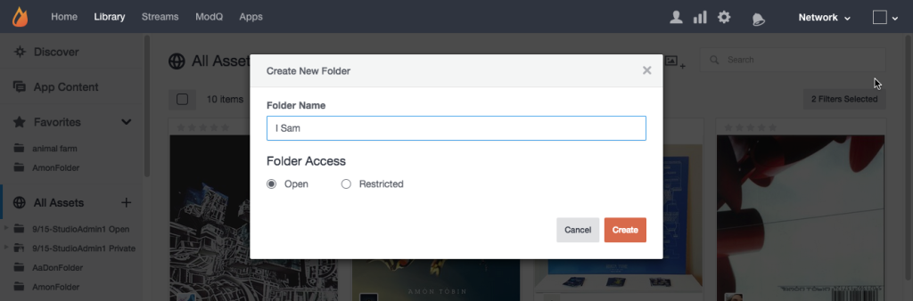

# Elementmappen maken{#create-asset-folders}

Maak mappen om elementen te ordenen.

Als u een nieuwe map maakt, wordt deze in alfabetische volgorde toegevoegd aan de lijst Alle elementen. Als u een submap wilt toevoegen, selecteert u eerst de map waarin de submap zich bevindt en klikt u op het pictogram **[!UICONTROL Create New Subfolder]** boven aan de pagina.

1. Klik **[!UICONTROL Create new folder]** van de boommening, ga een naam in, en klik **[!UICONTROL Create]** om de omslag op het hoogste niveau van Alle Middelen tot stand te brengen.
1. Selecteer een map en klik op het pictogram **[!UICONTROL Create New Subfolder]** boven aan de pagina om een submap toe te voegen.
1. Maak een nieuwe map wanneer u inhoud toevoegt aan uw Asset Library via het dialoogvenster **[!UICONTROL Add to folder > Select folder]**.
