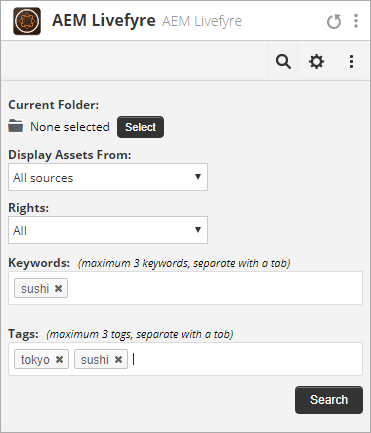

# Adobe Experience Manager Livefyre gebruiken met Hootsuite{#use-adobe-experience-manager-livefyre-with-hootsuite}

Leer hoe u Experience Manager Livefyre met Hootsuite gebruikt, zodat u door de gebruiker gegenereerde inhoud rechtstreeks vanuit het dashboard van de Hootsuite kunt beheren en delen.

## Adobe Experience Manager Livefyre gebruiken met Hootsuite {#topic_FB6E613DBCF74F39ABD5045C501EA326}

Leer hoe u Experience Manager Livefyre met Hootsuite gebruikt, zodat u door de gebruiker gegenereerde inhoud rechtstreeks vanuit het dashboard van de Hootsuite kunt beheren en delen.

## Aan de slag {#task_22699BD901C24384AB2DC02D926D8F4A}

Taakcontext

1. Installeer Adobe Experience Manager Livefyre for Hootsuite vanuit de Hootsuite App Directory.

1. Van uw dashboard van de Hootsuite, klik **Aanmelden met Adobe**.

   

1. Meld u aan bij Experience Manager Livefyre met uw LiveCyre-referenties.
1. Klikken **Autoriseren** om Hootsuite toestemming te geven om toegang te krijgen tot uw bibliotheken.

   

   Zodra u toestemming verleent, zult u terug naar het dashboard van de Hootsuite worden genomen waar u naar activa in uw bibliotheken van het Leven van de Experience Manager kunt zoeken.

## Zoeken naar elementen {#task_0B011B0C539E400BB72A6DF69FBF66C0}

Taakcontext

1. Klik op het zoekpictogram in de menubalk om te zoeken naar elementen in uw bibliotheken van de Experience Manager LiveCycle.

   

1. Klikken **Selecteren** en wordt een pop-up weergegeven met al uw bibliotheken.
1. Klik op de map van een bibliotheek en klik vervolgens op **Map selecteren** om de bibliotheek te selecteren die in uw stroom van de Hootsuite zal worden getoond.

   

## Filteropties {#concept_5D062A9CD61A4B2E90784E5AA31CB16D}

U kunt de zoekresultaten filteren met de secties Elementen weergeven van, Rechten, Trefwoorden en Codes.

De filteropties omvatten:

| Sectie | Beschrijving |
|--- |--- |
| Elementen weergeven van | Selecteer deze optie om elementen uit Alle bronnen of uit één afzonderlijke bron weer te geven. Bijvoorbeeld: Instagram, Twitter, Facebook, enz. |
| Rechten | Selecteer deze optie om alleen elementen weer te geven waarvoor specifieke rechten zijn ingesteld. |
| Trefwoorden | Selecteer deze optie om de resultaten te filteren op Trefwoorden of Tags. Filteren op trefwoorden doorzoekt zowel de tekstinhoud van een bericht als de weergavenaam en gebruikersnaam van de auteur. |
| Tags | Selecteer deze optie om de resultaten te filteren op Trefwoorden of Tags. Filteren op trefwoorden doorzoekt zowel de tekstinhoud van een bericht als de weergavenaam en gebruikersnaam van de auteur. |

Nadat u de zoekparameters hebt geselecteerd, worden de elementen in de stream weergegeven wanneer u de zoekopdracht uitvoert:

### Opties voor menu Stream

Als u op de naam of het pictogram van de gebruiker klikt, wordt de gebruiker op het betreffende netwerk weergegeven. Als u op de tijd klikt, wordt het originele artikel weergegeven. Wanneer de muis zich boven het item bevindt, worden meer opties weergegeven. Klik op Delen 

Het pictogram zal de huidige activa aan het netwerk toevoegen stelt doos samen, toestaand u om het met uw netwerken via Hootsuite te delen.

>[!NOTE]
>
>De knop Delen wordt alleen weergegeven wanneer u filtert naar elementen met toegekende rechten.

Klik op Toewijzen   pictogram om het huidige punt aan één van uw teamleden van de Hootsuite toe te wijzen. Als een punt reeds is toegewezen, los  wordt weergegeven. Klik erop om de huidige toewijzing op te lossen.

### Andere App-menu&#39;s

Klik op Instellingen   kunt u de verbinding met de huidige Experience Manager Live-account verbreken en verbinding maken met een andere account.

Klik op het menu   toont koppelingen voor dit document, de ondersteuning en de website van Synaptive.

## Experience Manager Livefyre App Plugin {#task_33C8CEF4F5E44830B970BB3A7AAA2AA6}

U kunt uw elementenbibliotheken niet alleen weergeven in een Hootsuite-stream, maar u kunt ook items uit Instagram-, Twitter-, Facebook- en YouTube-streams opslaan in uw Experience Manager Livefyre-bibliotheken.

1. Klik op het menupictogram onder aan elk item.

   

1. Selecteren **Verzenden naar AEM Livefyre**.
1. Selecteer een of meer bibliotheken waarin u het element wilt opslaan.

   

1. Klikken **Opslaan in bibliotheek** en het item wordt opgeslagen in de bibliotheken die u hebt geselecteerd.

## Experience Manager Livefyre Media Library Component {#task_9CA2D5D49F8E463F9EF475BC09C8ACC9}

U hebt toegang tot uw middelen via Media Components (Media-componenten van Hootsuite Composer).

1. Klik in de Composer op de knop **Media Library openen** in de **Media** sectie.

   

1. Selecteer Adobe Experience Manager Live in het vervolgkeuzemenu en uw bestanden worden weergegeven.

   

1. Als u elementen wilt toevoegen aan de huidige advertentie die u schrijft, klikt u erop. Als u naar een bepaald element wilt zoeken, voert u de zoektermen in het dialoogvenster **Media zoeken** en worden de resultaten weergegeven.
