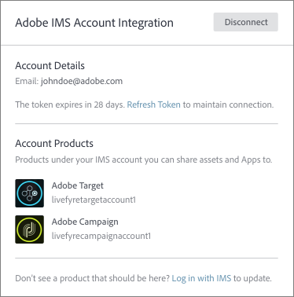
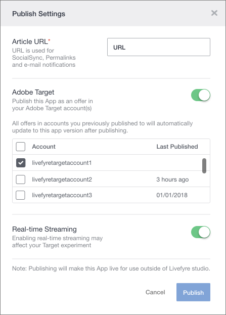

# Adobe Experience Manager Live gebruiken met Adobe Target {#livefyre-target}

Dankzij de integratie van LiveCycle met Adobe Target kunt u LiveCyre-apps rechtstreeks delen met uw bibliotheek met doelaanbiedingen.

## Een LiveCyre-instantie verbinden met Doel {#connect-livefyre-target}

Sluit een LiveCycle-instantie aan op Adobe Target door uw Adobe IMS-account te koppelen in gebruikersinstellingen.

1. Klik in LiveCycle Studio op het **[!UICONTROL Users]** tabblad.

1. Selecteer de gebruikersaccount waarmee u via IMS-accountintegratie verbinding wilt maken met Target.

1. Klik op **[!UICONTROL Connect]**.

1. Voer uw IMS-referenties in.

De exemplaren van het product die uw Adobe IMS-account kan weergeven in het venster Adobe IMS Integration.

Uw LiveCycle-instantie is nu verbonden met Adobe Target.

## Een LiveCyre-app delen met Adobe Target {#share-livefyre-target}

Deel een app die in LiveCyre Studio is gemaakt, rechtstreeks met Adobe Target.

1. Klik in LiveCycle Studio op het **[!UICONTROL Apps]** tabblad.

1. Selecteer de app die u wilt delen naar Adobe Target.

1. Klik op **[!UICONTROL Publish]**.

1. Klik in de publicatie-instellingen op de schakeloptie Adobe Target.

Er wordt een lijst met doelinstanties weergegeven.

1. Selecteer de instantie van het Doel waarin u App wilt delen.

1. Klik op  **[!UICONTROL Publish]**.

De Livefyre-app is nu beschikbaar voor gebruik in de bibliotheek met doelaanbiedingen. Zie Inhoud [en](/help/using/c-library/t-publish-content.md) aanbiedingen  publiceren in de documentatie over het doel voor meer informatie over het publiceren van apps.