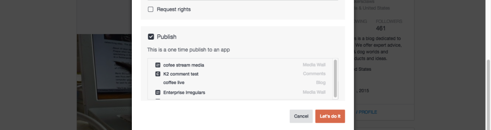

# Inhoud publiceren{#publish-content}

Inhoud rechtstreeks publiceren naar een app.

Inhoud die rechtstreeks naar een app is gepubliceerd, wordt niet opgeslagen in uw Asset Library.

1. **[!UICONTROL View Details]** voor een actief.
1. Selecteer het selectievakje **[!UICONTROL Publish]** in het dialoogvenster **[!UICONTROL Advanced Options]**.
1. Selecteer de app waarop het item moet worden gepubliceerd.
1. Klik op **[!UICONTROL Let’s do it]**.
