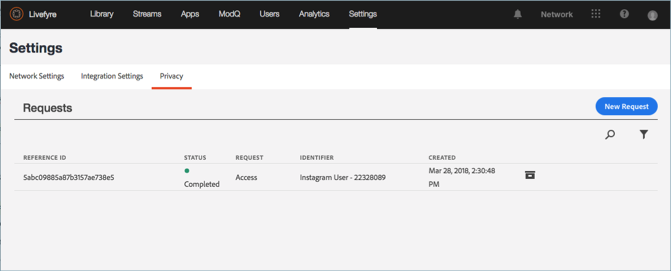
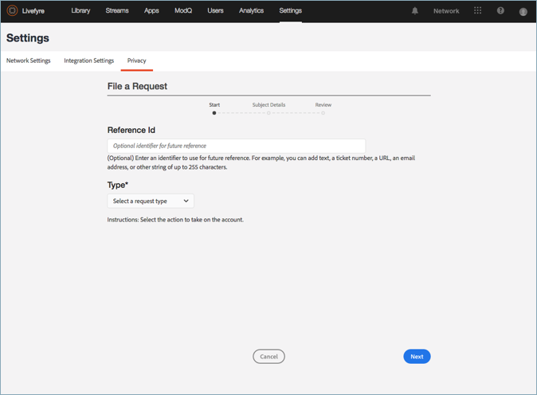
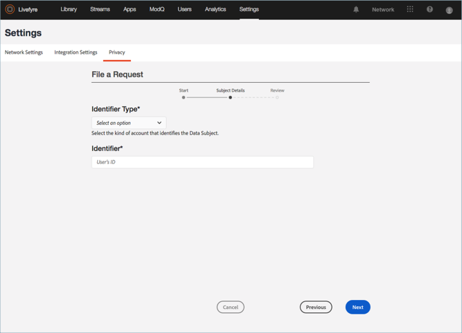
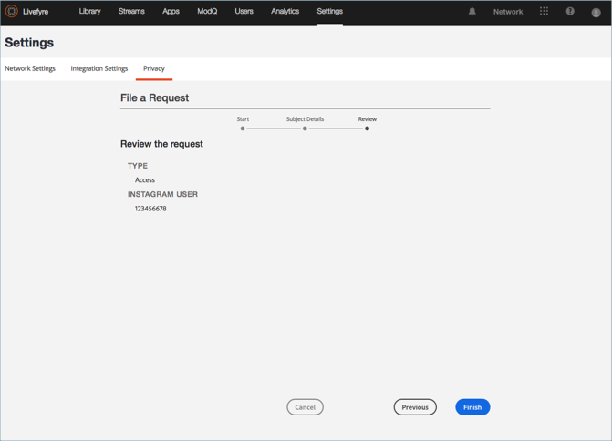

# Een privacyverzoek maken{#create-a-privacy-request}

Maak een privacyaanvraag in LiveCyre.

Verwijder alle gegevens voor een gebruiker, genereer een rapport van alle gegevens voor een gebruiker en breng wijzigingen in de optie Weigeren of Weigeren aan met behulp van dit proces.

U kunt als volgt een gebruiker zoeken en zoeken en een rapport over de inhoud ervan genereren:

1. Ga naar **[!UICONTROL Settings > Privacy]** en klik vervolgens op **[!UICONTROL Create Request]**.

   

1. Vul de gegevens in het venster **[!UICONTROL Submit Request]** in:

   * **[!UICONTROL Reference Id]**. Voer een id in die u wilt gebruiken voor toekomstige referentie. U kunt bijvoorbeeld tekst, een ticketnummer, een URL, een e-mailadres of een andere tekenreeks van maximaal 255 tekens toevoegen
   * **[!UICONTROL Type]**

      * **Toegang**. Hiermee worden alle beschikbare gegevens verzameld die aan het account zijn gekoppeld. Gevoelige details, bijvoorbeeld wachtwoorden of sociale gegevens, worden verduisterd of weggelaten.

      * **Verwijderen**. Hiermee worden alle gegevens die aan de account zijn gekoppeld, gewist of verborgen. **Als u deze optie kiest en op Verzenden klikt, kunt u deze actie niet omkeren of annuleren  *en kunt u verwijderde gegevens niet herstellen.*** Als de rekening tot een gebruiker van de Studio van de Livefy behoort, zullen sommige gegevens worden bewaard om de integriteit van uw bedrijfsverslagen te handhaven.

         >[!IMPORTANT]
         >
         >Als u gegevens voor een account verwijdert, worden de aan de account gekoppelde gegevens permanent verwijderd of vernietigd. U kunt deze handeling niet ongedaan maken en u kunt de gegevens ook niet herstellen nadat u deze hebt verwijderd.

      * **Uitschakelen**. Voorkomt dat LiveCycle passief gegevens of inhoud van een sociale account verzamelt via Streams of sociale zoekopdrachten. Inschakelen en Weigeren zijn niet van toepassing op geregistreerde gebruikers
      * **Inschakelen**. Biedt Livefyre de mogelijkheid om passief gegevens of inhoud te verzamelen van een sociale account die voorheen via Streams of Sociaal zoeken had uitgekozen. Inschakelen en Weigeren zijn niet van toepassing op geregistreerde gebruikers

      

   * **[!UICONTROL Identifier Type]** en  **[!UICONTROL Identifier]**

      * **[!UICONTROL User Account]**

         * Identificeert een rekening van een geregistreerde gebruiker door de identiteitskaart van de Rekening van de Gebruiker die door uw Systeem van het Beheer van de Gebruiker of Gebruiker van de Studio van Livefyre wordt geproduceerd - herkenningsteken. U kunt de gebruikersnaam van de gebruikersaccount ook vinden in Gebruikersdetails voor de gebruiker in **LiveCycle** **Gebruikersinstellingen** of in de details van de inhoud in **Asset Library** of **App Content**

         * Toegestane waarden: Alfanumerieke tekenreeks van maximaal 255 tekens. Een e-mailadres is geen geldige invoer
      * **[!UICONTROL Facebook User]**

         * Hiermee wordt een account aangeduid met een numerieke id die door Facebook is opgegeven. De aanvrager moet dit opgeven. U vindt instructies over het zoeken naar de numerieke Facebook-id [hier](https://www.facebook.com/help/1397933243846983?helpref=faq_content)
         * Toegestane waarden: 6-16 numerieke tekens
      * **[!UICONTROL Instagram User]**

         * Identificeert de account met een numerieke id die door Instagram wordt opgegeven. De aanvrager moet dit opgeven. U vindt instructies voor het zoeken van de numerieke Instagram-id op een Instagram-account
         * Toegestane waarden: 5-16 numerieke tekens
      * **[!UICONTROL Twitter User]**

         * Hiermee wordt een account aangeduid met een numerieke id die door Twitter is opgegeven. De persoon die de privacywijziging aanvraagt, moet dit opgeven. U vindt instructies voor het zoeken naar de numerieke Twitter-id van een Twitter-account
         * Toegestane waarden: 5-16 numerieke tekens
      * **[!UICONTROL YouTube User]**

         * Hiermee wordt een account aangeduid met een numerieke id die door YouTube is opgegeven. De persoon die de privacywijziging aanvraagt, moet dit opgeven. U vindt instructies over het zoeken naar de numerieke YouTube-id op een YouTube-account [hier](https://support.google.com/youtube/answer/3250431?hl=en)
         * Toegestane waarden: 5-16 numerieke tekens
      * **[!UICONTROL Generic Author]**

         * Hiermee wordt een account aangeduid met een JID (Livefy Author ID). Gebruik deze optie voor inhoud die via RSS, Tumblr, of URLs wordt geleverd. Zoek naar inhoud die aan de auteur is toegewezen in **App Content** of **Asset Library** en selecteer vervolgens een item om deze id te zoeken. De id is beschikbaar in **App Content** onder **Info** of in **Asset Library** onder **Author** in de sectie **Details**

         * Toegestane waarden: Alfanumerieke tekenreeks van maximaal 255 tekens

         

1. Klik op **[!UICONTROL Finish]**.

   

1. (Alleen voor verzoeken om verwijderen) Bevestig dat u alle gegevens voor de gebruiker wilt verwijderen.

   >[!IMPORTANT]
   >
   >Als u gegevens voor een account verwijdert, worden de aan de account gekoppelde gegevens permanent verwijderd of vernietigd. U kunt deze handeling niet ongedaan maken en u kunt de gegevens ook niet herstellen nadat u deze hebt verwijderd.

