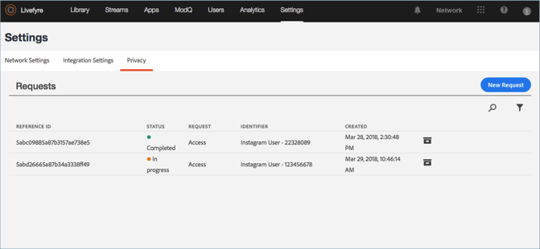

# Een privacyrapport weergeven{#view-a-privacy-report}

Bekijk een privacyrapport in LiveCyre om te zien welke informatie in Livefyre voor een gebruiker wordt geregistreerd.

1. Ga naar **[!UICONTROL Settings > Privacy]**.
1. Klik op een privacyrapport in de lijst om dit te bekijken.

