# Tekenreeksen lokaliseren{#localize-strings}

De tekenreeksen van de LiveCyre-apps aanpassen.

De tekstreeksen voor de meeste HTML-elementen in een LiveCycle-app kunnen worden aangepast. Dit biedt de flexibiliteit om de tekst van gerenderde HTML-elementen, zoals de knop &quot;Plaatsen als&quot;, de tekst &quot;Aantal opmerkingen&quot; of de knop &quot;Aanmelden&quot; te wijzigen in een geldige UTF-8-tekenreeks. Gebruik deze functie om persoonlijkheid toe te voegen aan uw implementatie van de stream of om de taal in de app voor uw gebruikersbasis te lokaliseren.

* Opmerkingen, chat en liveblog

   * [Implementatie](#c-localize-strings/section_im4_224_xz)
   * [Accounttoegang](#c-localize-strings/section_cm3_d24_xz)
   * [Stream-info](#c-localize-strings/section_wx1_c24_xz)
   * [Stream sorteren](#c-localize-strings/section_ih2_124_xz)
   * [Informatie over inhoud](#c-localize-strings/section_llv_yd4_xz)
   * [Aanbevolen inhoud](#c-localize-strings/section_gmw_vd4_xz)
   * [Teksteditor](#c-localize-strings/section_ky5_td4_xz)
   * [Reactieopties](#c-localize-strings/section_zvt_qd4_xz)
   * [Opmerkingmelding](#c-localize-strings/section_qqt_pd4_xz)
   * [Foutberichten](#c-localize-strings/section_omz_jxn_xz)

* [Datum- en tijdnotatie](#c-localize-strings/section_yz4_g5n_xz)
* [Mediumwand](#c-localize-strings/section_vwt_d5n_xz)
* [Kaart](#c-localize-strings/section_fxv_c5n_xz)
* [Mozaïek](#c-localize-strings/section_e2s_b5n_xz)
* [Carousel](#c-localize-strings/section_l2z_hkn_xz)
* [Functiekaart](#c-localize-strings/section_mw2_hkn_xz)
* [Opiniepeiling](#c-localize-strings/section_pdg_fwh_xz)
* [Livefyre-id](#c-localize-strings/section_zc3_xvh_xz)
* Meer:
   * [Tekstreeksen controleren](/help/using/c-settings-other/c-translation-sets/c-review-text-strings.md#c_review_text_strings)
   * [Sidenotes](/help/using/c-settings-other/c-translation-sets/c-sidenotes-text-strings.md#c_sidenotes_text_strings)

## Implementatie {#section_im4_224_xz}

Als u deze functie wilt implementeren, geeft u een 1-1-objecttoewijzing van de tekenreeksen die u wilt overschrijven door aan het JavaScript-configuratieobject. Als u geen veld opgeeft, wordt de standaardtekst gebruikt.

Voorbeeld:

```
var customStrings = {     
   postAsButton: "New Post As Text",     
   postEditButton: "New Post Edit Text"  
};   
   convConfig["strings"] = customStrings; fyre.conv.load(     
   networkConfig,     
   [convConfig],     
   function(){}  
);
```

Deze pagina bevat alle tekstreeksen die kunnen worden aangepast voor de LiveCycle Core-toepassingen.

## Accounttoegang {#section_cm3_d24_xz}

Tekenreeksen beschikbaar voor het verificatieproces en in de geverifieerde gebruikersmenu&#39;s.

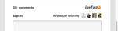

| Element | Sleutel | Standaardtekst |
|---|---|---|
|  | displayName | %s |
|  | editProfile | Profiel bewerken |
|  | notificationSettings | Meldingsinstellingen |
|  | siteAdmin | Admin Console (koppelingen naar Studio) |
|  | signOut | Afmelden |

## Stream-info {#section_wx1_c24_xz}

Tekenreeksen beschikbaar voor informatie en weergave van de inhoudsstroom. Hier wordt een overzicht gegeven van het aantal mensen dat luistert, het aantal berichten voor de app en worden gebruikers in staat gesteld zich aan te melden of toegang te krijgen tot hun accountgegevens.

| Sleutel | Standaardtekst | Stroomgegevens |
|---|---|---|
|  | commentCountLabelZero | Opmerking %s |
|  | commentCountLabel | Opmerking %s |
|  | commentCountLabelPlural | %s opmerkingen |
|  | listenerCount | persoon die luistert |
|  | listenerCountPlural | mensen luisteren |
|  | liveblogPostCountLabelZero | post |
|  | liveblogPostCountLabel | post |
|  | liveblogPostCountLabelPlural | posten |
| Verbindingsopties | threadBreakoutButton | Volledige thread tonen |
|  | toggleCollapse | Samenvouwen in-/uitschakelen |
| Hoge snelheid/opmerkingen in de wachtrij | vernieuwen | Vernieuwen |
|  | newComment | Nieuwe opmerking |
|  | newComments | Nieuwe opmerkingen |
|  | newReply | nieuw antwoord |
|  | newReplies | nieuwe antwoorden |

## Stream sorteren {#section_ih2_124_xz}

Hiermee kunt u geretourneerde inhoud sorteren op leeftijd of populariteit.

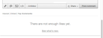

| Sleutel | Standaardtekst | Koptekstopties |
|---|---|---|
|  | sortNewest | Nieuwst |
|  | sortOldest | Oudst |
|  | sortTopComments | Opmerkingen bovenaan |
|  | sortHotThreads | Hot Threads |
|  | sortSeparator |  |  |
|  | streamSorting | Laden |
|  | topCommentsContentNotFoundMsg | Er zijn nog niet genoeg dingen. |
|  | hotThreadsContentNotFoundMsg | Er zijn nog niet genoeg draden. |
|  | streamRefreshMsg | Bekijk de nieuwe functies. |
| Opties voor voettekst | archiveHeaderTitle | Uit het archief |
|  | archiveShowMore | Meer weergeven |
|  | showMore | Meer opmerkingen tonen |
|  | showMoreLiveblog | Meer berichten weergeven |

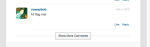

## Informatie over inhoud {#section_llv_yd4_xz}

Hier worden de postgegevens weergegeven: de gebruikersnaam, eventueel toegepaste gebruikerscodes en de posttijd.

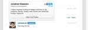  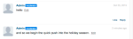

| Sleutel | Standaardtekst | Auteur |
|---|---|---|
|  | moderator | moderator |
|  | hovercardViewProfile | Volledig profiel weergeven |
| Post Info | timeJustNow | net nu |
|  | timeMinutesAgo | minuut geleden |
|  | timeMinutesAgoPlural | minuten geleden |
|  | timeHoursAgo | uur geleden |
|  | timeHoursAgoPlural | uur geleden |
|  | timeDaysAgo | dag geleden |
|  | timeDaysAgoPlural | dagen geleden |
|  | likePlural | Likes |
|  | likeSingular | leuk |
|  | moderatorEditTimestamp | Bewerkt door een Moderator |
|  | commentTombstone | Deze opmerking is verwijderd |
|  | permalinkNotFoundMsg | Deze opmerking is niet meer zichtbaar. |
|  | quickProfileTooltip | Snel profiel |

## Aanbevolen inhoud {#section_gmw_vd4_xz}

Indien ingeschakeld, wordt aanbevolen inhoud boven aan de stream weergegeven.

|  | Sleutel | Standaardtekst |
|---|---|---|
| Aanbevolen labels |  |  |
| 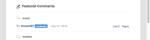 | featuredCommentsTag | Topaanbieding |
|  | featuredCommentsTitlePlural | Aanbevolen opmerkingen |

## Teksteditor {#section_ky5_td4_xz}

Standaard beschikbaar boven aan de pagina voor alle gebruikers.

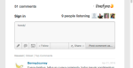

|  | Sleutel | Standaardtekst |
|---|---|---| 
| Editor-knoppen | volgen | + Volg |
|  | unfollow | - Ongedaan maken |
|  | liveblogFollow | Live blog volgen |
|  | liveblogUnfollow | Live blog ongedaan maken |
|  | postButton (beschikbaar voor aangemelde gebruikers.) | Opmerking bericht |
|  | postAsButton(Beschikbaar voor niet-geverifieerde gebruikers.) | Opmerking verzenden als... |
|  | postEditButton | Opmerking bewerken |
|  | postEditAsButton | Opmerking bewerken als... |
|  | postEditCancelButton | Annuleren |
|  | editorDisabled | Dit gesprek is momenteel gesloten voor nieuwe opmerkingen. |
| Chatopties | livechatPostButtonLabel | Post |
|  | livechatPostEditButton | Bewerken |
|  | livechatWindowsInstruction | Druk op Ctrl+Enter om te posten |
|  | livechatOtherInstruction | Druk op Command+Enter om te posten |

## Reactieopties {#section_zvt_qd4_xz}

Tenzij anders vermeld, beschikbaar aan alle het programma geopende gebruikers. Plaats de muis boven een inhoudspaneel voor toegang.

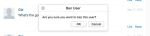

| Sleutel | Standaardtekst |  |
|---|---|---|
| Antwoordopties gebruiker | Beschikbaar voor eindgebruikers. |  |
| flagButton | Markering |
|  | flagCommentTooltip | Markering |
|  | editButton (alleen beschikbaar voor auteurs en moderatoren, indien ingeschakeld). | Bewerken |
|  | deleteButton (alleen beschikbaar voor auteurs en moderatoren, indien ingeschakeld). | Verwijderen |
|  | deleteCommentTooltip | Verwijderen |
|  | shareButton | Delen |
|  | shareCommentTooltip | Delen |
|  | likeButton | leuk |
|  | differentButton | Anders |
|  | responseButton | Reageren |
|  | responseButtonSingular (beschikbaar voor Chat en Live Blog.) | Reageren |
|  | responseButtonPlural(Beschikbaar voor Chat en Live Blog.) | Reacties |

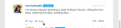

| Sleutel | Standaardtekst |  |
|---|---|---|
| Markeringsmodaal | flagTitle | Opmerking van %s markeren |
|  | flagSubtitle | Markeren als |
|  | flagDefaultSelectOption | Selecteren |
|  | flagSpam | Spam |
|  | flagSpamButton | Spam |
|  | flagSpamCommentTooltip | Spam |
|  | flagOffsive | Aanstootgevend |
|  | flagOffsiveButton | Aanstootgevend |
|  | flagOffsiveCommentTooltip | Aanstootgevend |
|  | flagDisagreement | Niet akkoord |
|  | flagDisagreementButton | Niet akkoord |
|  | flagDisagreementCommentTooltip | Niet akkoord |
|  | flagOffTopic | Uit onderwerp |
|  | flagOfftopicButton | Uit onderwerp |
|  | flagOfftopicCommentTooltip | Uit onderwerp |
|  | flagEmail | E-mail |
|  | flagEmailPlaceholder | you@example.com |
|  | flagNotes | Notities |
|  | flagNotesPlaceholder | Hier typen... |
|  | flagConfirmButton | OK |
|  | flagCancelButton | Annuleren |
|  | flagConfirmationMessage | Opmerking van %s markeren als %s? |
|  | flagSuccessMsg | Opmerking is gemarkeerd. |

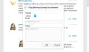

| Sleutel | Standaardtekst |  |
|---|---|---|
| Share Modal | shareTitle | Opmerking delen |
|  | sharePlaceholderText | Wat denk je? |
|  | shareLabel | Delen op: |
|  | shareTextTwitter | blank |
|  | shareTextFacebook | blank |
|  | shareTextLinkedin | blank |
|  | shareButtonText | Delen |
|  | sharePermalink | Permalink |
|  | loadingPermalink | Korte URL laden... |
|  | shareText | Ik heb zojuist een opmerking geplaatst. Kijk eens! |

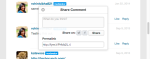

| Sleutel | Standaardtekst |  |
|---|---|---|
| Reageren modaal | postReplyAsButton | Opmerking verzenden als... |
|  | postReplyButton(Beschikbaar voor aangemelde gebruikers.) | Opmerking bericht |
|  | backToHotThreads | Terug naar hot threads |

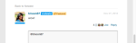

| Sleutel | Standaardtekst |  |
|---|---|---|
| Twitter @vermeld, modaal | notifyTitle | Opsomming delen |
|  | notifySubtitleTwitter | Tweet delen naar: |
|  | notifyDefaultText | Ik heb u in een Livefyre-opmerking genoemd! |
|  | notifyConfirmButton | OK |
|  | notifyCancelButton | Annuleren |
|  | notifyErrorGeneral | Oeps! Er is iets misgegaan! Livefyre is gewaarschuwd. |
|  | notifyErrorNoneSelected | U moet ten minste één vermelding ingeschakeld hebben. |
|  | notifyMenuTitle | Om uw vrienden te zien en te noemen |
|  | entryTwitterConnect | Verbinding maken met Twitter |
|  | notifyTwitterFetching | Vrienden ophalen... |
|  | notifySuccessMsg | Er zijn meldingen verzonden. |

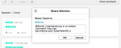

| Sleutel | Standaardtekst |  |
|---|---|---|
| Modal bewerken | Beschikbaar voor Studio Admins, Gebruikersmanagers of Moderatoren |  |
| @(@vermelding.) | &lt;/>(Opent het aangepaste HTML-venster.) |  |
|  | customHtmlDialogTitle(Wordt weergegeven als de kop voor het modaal.) | Aangepaste HTML toevoegen |

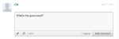

| Sleutel | Standaardtekst |  |
|---|---|---|
| Opties voor moderatorrespons | Beschikbaar voor Studio Admins, de Managers van de Gebruiker of Moderatoren. |  |
| pendingComment | hangend |
|  | banUserButton | Ban-gebruiker |
|  | banUserTooltip | Ban-gebruiker |
|  | bozoButton | Bozo |
|  | bozoCommentTooltip | Bozo |
|  | featureButton | Functie |
|  | featureCommentTooltip | Functie |
|  | unfeatureButton | Ongedaan maken |
|  | featuredCommentTooltip | Ongedaan maken |

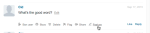

| Sleutel | Standaardtekst |  |
|---|---|---|
| Ban User modal | Beschikbaar voor Studio Admins, de Managers van de Gebruiker of Moderatoren. |  |
| banTitle | Ban-gebruiker |  |
|  | banBevestiging | Weet u zeker dat u deze gebruiker wilt verbieden? |
|  | banConfirmButton | OK |
|  | banCancelButton | Annuleren |

## Opmerkingmelding {#section_qqt_pd4_xz}

Indien toegelaten, beschikbaar bij de bodem van de pagina voor alle het gesprekstoepassingen van het Leven.

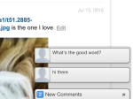

|  | Sleutel | Standaardtekst |
|---|---|---|
| Berichtgevingslabels | commentNotifier | Nieuwe opmerking |
|  | commentNotifierPlural | Nieuwe opmerkingen |
|  | liveblogNotifier | Nieuwe advertentie |
|  | liveblogNotifierPlural | Nieuwe berichten |

## Foutberichten {#section_omz_jxn_xz}

Tekenreeksen beschikbaar voor aanpasbare foutberichten.

| Sleutel | Standaardtekst |
|---|---|
| errorAuthError | U bent niet bevoegd om commentaar op dit gesprek te plaatsen |
| errorCommentsNotAllowed | Opmerkingen zijn niet toegestaan in dit gesprek |
| errorDefault | Er is een fout opgetreden. Probeer het opnieuw. |
| errorDuplicate | U mag de opmerking niet tweemaal plaatsen, wat u ook leuk vindt. |
| errorEditDuplicate | U moet de hoofdtekst van de opmerking wijzigen wanneer u deze bewerkt. |
| errorEditNotAllowed | U bent niet gemachtigd om opmerkingen over dit gesprek te bewerken. |
| errorEditTimeExceeded | De bewerkingsperiode voor opmerkingen is verlopen. |
| errorEmpty | Het lijkt erop dat u een leeg commentaar probeert te plaatsen. |
| errorExpired | Uw sessie is verlopen. Laad de pagina opnieuw. |
| errorFlagNotSelected | Selecteer een vlagtype. |
| errorGuestLiked | Alleen diegenen met accounts kunnen van inhoud houden. |
| errorInsufficientPermissions | Onvoldoende machtigingen |
| errorInvalidChar | Het lijkt erop dat u probeert een ongeldig teken te plaatsen. |
| errorLikeOwnComment | Je kunt je eigen commentaar niet aanspreken |
| errorMalformed | Het lijkt erop dat u verkeerde inhoud probeert te posten. |
| errorMaxChars | Je commentaar is te lang. Bewerk het bestand en probeer het opnieuw. |
| errorMediaNotAvailable | De media zijn niet meer zichtbaar. |
| errorShowMore | Er is een fout opgetreden bij het laden van meer opmerkingen. |
| MultipleMediaNotAllowedError | Met uw machtigingen beschikt u slechts over één mediabijlage tegelijk. |

## Datum- en tijdnotatie {#section_yz4_g5n_xz}

Vertaal en pas aan hoe datums worden weergegeven op inhoudskaarten in visualisatie-apps.

| Sleutel | Standaardtekst |
|---|---|
| hoursAgo | {number}h |
| hoursAgoSingular | {number}h |
| justNow | 1s |
| minutesAgo | {number}m |
| minutesAgoSingular | {number}m |
| monthDayFormat | {day} {monthAbbrev} |
| monthDayYearFormat | {day} {monthAbbrev} {year} |
| monthNames | januari, februari, maart, april, mei, juni, juli, augustus, september, oktober, november, december |
| monthNamesAbbrev | jan, feb, mrt, apr, mei, jun, jul, aug, sep, okt, nov, dec |
| secondsAgo | {number}s |
| secondsAgoSingular | {number}s |

## Mediumwand {#section_vwt_d5n_xz}

Tekenreeksen beschikbaar voor de Media Wall App.

| Sleutel | Standaardtekst |
|---|---|
| featuredText | Topaanbieding |
| shareButtonText | Delen |

| Sleutel | Standaardtekst |
|---|---|
| postButtonText | Wat is uw mening? |
| postModalTitle | Plaats uw opmerking |
| postModalButton | Plaats uw opmerking |
| postModalPlaceholder | Wat wilt u zeggen? |
| showMoreButtonText | Meer laden |
| shareButtonText | Delen |

## Kaart {#section_fxv_c5n_xz}

Tekenreeksen beschikbaar voor Kaarten.

| Sleutel | Standaardtekst |
|---|---|
| featuredText | Topaanbieding |
| shareButtonText | Delen |

## Mozaïek {#section_e2s_b5n_xz}

Tekenreeksen beschikbaar voor mozaïek.

| Sleutel | Standaardtekst |
|---|---|
| featuredText | Topaanbieding |
| shareButtonText | Delen |

## Carousel {#section_l2z_hkn_xz}

Tekenreeksen beschikbaar voor Carousel.

| Sleutel | Standaardtekst |
|---|---|
| featuredText | Topaanbieding |
| shareButtonText | Delen |

## Functiekaart {#section_mw2_hkn_xz}

Tekenreeksen beschikbaar voor de functiekaart.

| Sleutel | Standaardtekst |
|---|---|
| featuredText | Topaanbieding |
| shareButtonText | Delen |

## App uploaden {#section_grc_gkn_xz}

Tekenreeksen beschikbaar voor de uploadtoepassing.

| Sleutel | Standaardtekst |
|---|---|
| postButtonText | Wat is uw mening? |
| postModalTitle | Plaats uw opmerking |
| postModalButton | Plaats uw opmerking |
| postModalTitlePlaceholder | Voer een titel in |
| postModalPlaceholder | Wat wilt u zeggen? |
| postModalConfirationTitle | Bedankt voor het posten! |
| postModalConfirmationMessage | Je advertentie wordt gecontroleerd. |
| postModalConfirmationButton | Gereed |
| titel |  |
| message |  |
| editorErrorAttachmentsRequired | Een bijlage is vereist |
| editorErrorBody | Voeg een bericht toe |
| editorErrorDuplicate | U kunt de notitie niet twee keer plaatsen, zo veel als u wilt |
| editorErrorGeneric | Er is een fout opgetreden |
| editorErrorTitleRequired | Een titel is vereist |

## Opiniepeiling {#section_pdg_fwh_xz}

Tekenreeksen beschikbaar voor opiniepeilingen.

| Sleutel | Standaardtekst |
|---|---|
| totalVotesLabel | %s totaal aantal stemmen |
| shareStringText | Ik heb zojuist op %s gestemd. Wat is uw stem? |
| pollClosedLabel | Deze opiniepeiling is momenteel gesloten |

## Livefyre-id {#section_zc3_xvh_xz}

Tekenreeksen beschikbaar voor Livefyre Identity.

| Sleutel | Standaardtekst |
|--- |--- |
| automaticallyFollowConversations | Automatisch conversaties volgen waaraan ik deel |
| terugkeren | Vorige |
| bio | Bio |
| maken | Maken |
| createANnewAccount | Nieuw account maken |
| createNewAccountWithEmail | Een nieuw account maken met e-mail |
| changeAvatar | Avatar wijzigen |
| chooseFile | Bestand kiezen |
| completeAccount | Volledige account |
| emailWhenIemandReplies | E-mail wanneer iemand mij antwoordt |
| emailCommentsIFollow | E-mailopmerkingen in gesprekken die ik volg |
| emailSenttoResetPassword | E-mail verzonden! Controleer uw Postvak IN op een koppeling waarmee u het wachtwoord opnieuw kunt instellen |
| emailVerificationSent | E-mailverificatie verzonden |
| firstName | Voornaam |
| VergeetPassword | Wachtwoord vergeten? |
| VervergatYourPassword | Bent u uw wachtwoord vergeten? |
| VervergatYourPasswordInstructions | Voer hieronder uw gebruikersnaam of e-mailadres in en we sturen u een koppeling om uw wachtwoord te wijzigen. |
| formInputCloseButtonText | Sluiten |
| formInputCancelButtonText | Annuleren |
| formInputSaveButtonText | Opslaan |
| hasNotLeftAnyComments | geen opmerkingen heeft achtergelaten |
| locationIsFrom | is afkomstig van |
| labelAvatar | Avatar |
| labelComments | Opmerkingen |
| labelConfirmNewPassword | Nieuw wachtwoord bevestigen |
| labelConfirmPassword | Wachtwoord bevestigen |
| labelEmail | E-mailadres |
| labelLikes | Likes |
| labelLoading | Laden |
| labelNewPassword | Nieuw wachtwoord |
| labelNotification | Meldingen |
| labelPassword | Wachtwoord |
| labelProfile | Profiel |
| labelGebruikersnaam | Gebruikersnaam |
| labelGebruikersnaamOrEmail | Gebruikersnaam of e-mail |
| lastName | Achternaam |
| livefyreAccount | Livefyre-account |
| locatie | Locatie |
| loadingProfile | Profiel laden |
| newPassword | Nieuw wachtwoord |
| oldPassword | Oud wachtwoord |
| op | op |
| of | of |
| passwordLinkExpired | De koppeling waarop u hebt geklikt om uw wachtwoord opnieuw in te stellen, is verlopen. Stel uw wachtwoord opnieuw in en we sturen u een nieuwe koppeling. |
| pretecheckEmailToComplete | Controleer uw e-mail om uw registratie te voltooien. |
| gepost | Gepost |
| poweredBy | aangedreven door |
| profileNotificationImmediate | onmiddellijk |
| profileNotificationHourly | uurwerk |
| profileNotificationnever | nooit |
| recentComments | Recente opmerkingen |
| reset | Herstellen |
| resetPassword | Wachtwoord opnieuw instellen |
| signIn | Aanmelden |
| signInWith | Aanmelden met |
| signInWithEmail | Aanmelden met e-mail |
| signUp | Aanmelden |
| socialAccount | Sociale account |
| successPasswordChanged | Succes! Uw wachtwoord is gewijzigd en u bent nu aangemeld |
| termsAndConditions | Voorwaarden en bepalingen |
| termsAndConditionsIntro | Door u aan te melden accepteert u de |
| termsOfUse | Gebruiksvoorwaarden |
| termsOfUseIntro | Door u aan te melden, gaat u akkoord met |
| thisUser | Deze gebruiker |
| verifyPassword | Wachtwoord verifiëren |
| fileSizeLimit | max. 2 MB |
| accountnotatie gevonden | Account niet gevonden |
| avatarImageExceedSize | De avatar-afbeelding heeft een bestandslimiet van 2 MB overschreden |
| fieldisrequired | Veld accepteert alleen een geheel getal |
| fieldonlyacceptsavalidemail | Veld accepteert alleen geldige e-mail |
| fieldonlyacceptsletters | Veld accepteert alleen letters |
| filesizemustbelessthanMB | Bestandsgrootte moet kleiner zijn dan {#}MB |
| invalidusername or password | Gebruikersnaam of wachtwoord ongeldig |
| minimale lengthoektekens | Minimale lengte van {#} tekens |
| maximum lengthofcharacters | Maximale lengte van {#} tekens |
| wasfout | Er is een fout opgetreden |
| thisfieldisrequired | Dit veld is verplicht. |
| validfileextensions | Geldige bestandsextensies |
| waardestijging | Waarde moet overeenkomen |
| passwordLength | 6 tot 32 tekens lang zijn. |
| passwordCharacters | bevat zowel kleine als hoofdletters. |
| passwordSymbols | bevat ten minste één getal en één symbool. |
| passwordGebruikersnaam | bevat uw gebruikersnaam niet. |
| passwordPopoverTitle | Uw wachtwoord moet: |
| passwordErrorContainsFirstName | Het wachtwoord dat u hebt ingevoerd, bevat uw gebruikersnaam, voornaam of achternaam. Voer uit veiligheidsoverwegingen een wachtwoord in dat niet uw gebruikersnaam, voornaam of achternaam bevat. Houd er rekening mee dat uw wachtwoord het volgende moet bevatten: 6 tot 32 tekens Een A-symbool in kleine letters met hoofdletter als symbool |
| passwordErrorContainsLastName | Het wachtwoord dat u hebt ingevoerd, bevat uw gebruikersnaam, voornaam of achternaam. Voer uit veiligheidsoverwegingen een wachtwoord in dat niet uw gebruikersnaam, voornaam of achternaam bevat. Houd er rekening mee dat uw wachtwoord het volgende moet bevatten: 6 tot 32 tekens Een A-symbool in kleine letters met hoofdletter als symbool |
| passwordErrorContainsUserName | Het wachtwoord dat u hebt ingevoerd, bevat uw gebruikersnaam, voornaam of achternaam. Voer uit veiligheidsoverwegingen een wachtwoord in dat niet uw gebruikersnaam, voornaam of achternaam bevat. Houd er rekening mee dat uw wachtwoord het volgende moet bevatten: 6 tot 32 tekens Een A-symbool in kleine letters met hoofdletter als symbool |
| passwordErrorTooShort | Minimaal 6 tekens voor wachtwoord |
| passwordErrorTooLong | Maximaal 32 tekens voor wachtwoord |
| passwordErrorMissingUppercase | Wachtwoord moet ten minste één hoofdletter bevatten |
| passwordErrorMissingLowercase | Wachtwoord moet ten minste één kleine letter bevatten |
| passwordErrorMissingSymbol | Wachtwoord moet ten minste één symbool in de set bevatten `!@#$%^&*()?.,<>\’;:”[]{}|` |


