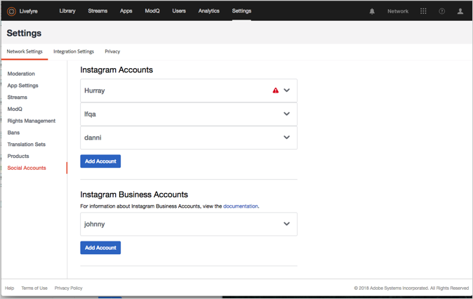
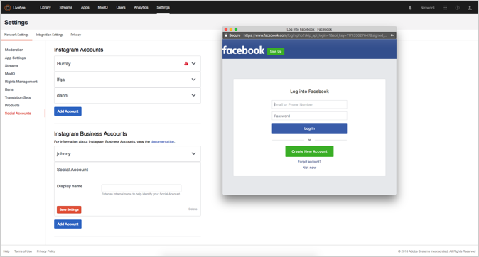

# Een sociale account toevoegen{#add-a-social-account}

Configureer een sociale account om rechten aan te vragen of naar UGC te zoeken in streams of sociale zoekopdrachten.

LiveCycle gebruikt sociale accounts van Twitter en Instagram om een sociale zoekopdracht uit te voeren (in de bibliotheek) of om Streams te gebruiken.

U moet een account in Twitter configureren om de sociale zoekfunctie van Twitter in de bibliotheek te gebruiken.

Instagram kent verschillende regels voor sociale accounts, afhankelijk van hoe u Adobe Livefyre gebruikt. Zie [Informatie over Instagram-accounts](/help/using/c-users-creating-accounts-with-studio-access/t-configure-social-accout-instagram/c-about-instagram-accounts.md#c_about_instagram_accounts) voor informatie over welk type sociale accounts u met LiveCycle kunt gebruiken.

Een sociale account configureren:

1. Ga naar **[!UICONTROL Settings >]** **[!UICONTROL Network Settings.]**
1. Navigeer naar de sectie **[!UICONTROL Social Accounts]** onder **[!UICONTROL Network Settings]**.
1. Klik op **[!UICONTROL Add Account]** onder het type sociale account dat u toevoegt. Er verschijnt een dialoogvenster waarin u de account voor LiveCycle kunt autoriseren.

   

   >[!NOTE]
   >
   >Wanneer u een zakelijke Instagram-account configureert, wordt u doorgestuurd naar een Facebook-aanmeldingsscherm. U kunt zich gewoon blijven aanmelden.     >

1. Klik op **[!UICONTROL Authorize App]** om door te gaan.
1. Voeg een **[!UICONTROL Display Name]** voor de account toe en klik vervolgens op **[!UICONTROL Save Settings.]**. Klik op **[!UICONTROL Social Account]** in de koptekst van het vak met accountgegevens om de account samen te vouwen.
