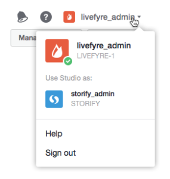

# Gebruikers die netwerken{#users-switching-networks} schakelen

U kunt veelvoudige netwerken van één enkele rekening van Studio beheren.

>[!NOTE]
>
>Dit komt niet vaak voor.

Het **[!UICONTROL Account]** keuzemenu maakt een lijst van alle gebruikersnamen verbonden aan de rekening van de Studio waaraan u momenteel het programma wordt geopend en de netwerken waaraan zij worden geassocieerd. Gebruik deze keuzelijst om het netwerk te selecteren u wenst om te leiden.

>[!NOTE]
>
>Terwijl de meeste gebruikers toestemmingen voor slechts één enkel netwerk zullen hebben, kunnen sommige gebruikers van Studio of veelvoudige plaatsen bezitten gematigd. De rekening van de Studio staat hen toe om met één enkele gebruikersbenaming en wachtwoord, dan schakelaar tussen de veelvoudige niveaus van de plaatstoegang binnen te loggen.

