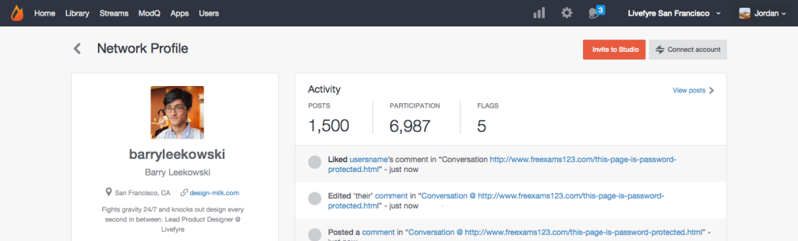

# Gebruikersaccounts koppelen{#link-user-accounts}

Koppel uw Studio-account aan uw Livefyre-account om al uw LiveCyre-sites of -netwerken vanaf één locatie te modereren of te beheren.

>[!NOTE]
>
>Als u wilt communiceren met een LiveCycle-app (bijvoorbeeld een opmerking achterlaten, een Sidenote toevoegen of inhoud delen), moet u zich aanmelden met de gebruikersnaam en het wachtwoord van uw LiveCycle-account en niet met de gebruikersnaam en het wachtwoord van uw Studio-account.

Accounts koppelen:

1. Meld u aan bij Studio nadat u een gebruikersprofiel voor LiveCycle op uw netwerk hebt gemaakt.
1. Ga naar **[!UICONTROL Users]**, zoek uw Profiel van de Gebruiker, en klik tweemaal om details te bekijken.
1. Klik op **[!UICONTROL Connect account]**.
1. Selecteer in het venster dat wordt geopend de gebruikersaccount die u aan deze account wilt koppelen.
1. Bevestig de **[!UICONTROL Link Profile]** informatie en klik **[!UICONTROL Link]**. 
