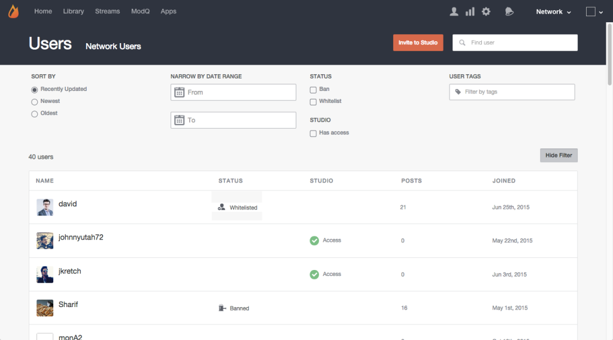

# Zoeken naar gebruikers{#search-for-users}

Gebruik het veld Zoeken boven aan de pagina om sitebezoekers te zoeken op Weergavenaam, Gebruikersnaam, E-mailadres of de datum waarop ze zich bij uw LiveCycle-netwerk hebben gevoegd.

>[!NOTE]
>
>Deze velden ondersteunen zoeken met jokertekens.

1. Klik **[!UICONTROL Show Filter]** om een paneel te openen waarvan de vermelde gebruikers kunnen worden gefiltreerd.
1. **[!UICONTROL Sort by]** updates van de vermelde gebruikersaccounts: Onlangs bijgewerkt, Nieuwst of Oudst.
1. **[!UICONTROL Narrow by Date Range]** om alleen gebruikersaccounts weer te geven die tijdens het invoerbereik zijn toegevoegd.
1. Alleen **[!UICONTROL Banned]** of **[!UICONTROL Whitelisted]** gebruikers weergeven.
1. Alleen **[!UICONTROL Studio]** gebruikers weergeven.
1. Alleen die accounts weergeven waaraan de invoer **[!UICONTROL User Tags]** is gekoppeld. 

